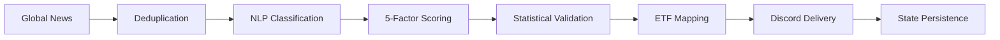

# Azalyst ETF Intelligence

> An institutional-style quantitative research platform built as a personal project. Not a hedge fund. Not a financial product. Just a passion for systematic research.
> 
> **Now with AI-powered optimization**: NVIDIA NIM (Mistral 7B) integration for intelligent strategy analysis and macro regime detection.

---

## Overview

Azalyst ETF Intelligence is a research infrastructure project for monitoring global news, classifying macro developments into investable sectors, and routing only the highest-conviction observations into a structured alert workflow. It is designed as a disciplined research system rather than a financial product, broker integration layer, or automated trading stack.

At a high level, the platform scans global news feeds, deduplicates and clusters related articles, applies a lightweight NLP-style sector classifier, computes a transparent five-factor confidence score, maps validated sector signals to ETFs across India (NSE/BSE) and global markets (NYSE/NASDAQ), and delivers structured reports to Discord. Every cycle is logged locally, and signal state is persisted so the system can enforce cooldowns, detect stronger updates, and maintain an audit trail across runs.

The system displays ETF platform information dynamically — showing which brokers offer each instrument (e.g., "iShares by BlackRock — IBKR / Schwab / Fidelity" for US ETFs, "NSE/BSE listed — Zerodha / Dhan / Groww" for Indian ETFs). This allows you to trade instruments through your preferred broker while maintaining consistent signal quality.

**New in 2026**: LLM-powered optimization using NVIDIA NIM's Mistral 7B Instruct model provides:
- Automated portfolio performance analysis with actionable improvement suggestions
- Signal enhancement with AI-driven allocation recommendations
- Macro regime detection and sector rotation guidance
- Auto-generated trade documentation for compliance
- Continuous learning from trade outcomes

The project exists for a simple reason: global macro events move faster than discretionary monitoring can reliably keep up with, yet most headline streams are too noisy to act on directly. Azalyst attempts to bridge that gap with disciplined filtering. The system is opinionated about what should qualify as a signal, conservative about what deserves distribution, and explicit about why a given alert cleared the bar.

## Dashboard Preview

Live monitor output (generated from the current portfolio/state artifacts):


Core capabilities:

- Global news scanning through **[WorldMonitor](https://github.com/koala73/worldmonitor)** and direct RSS feeds.
- Sector classification across 14+ research buckets using weighted keyword rules, negation handling, and article clustering.
- Five-factor confidence scoring with transparent component breakdowns.
- ETF opportunity mapping for India (NSE/BSE) and global markets (NYSE/NASDAQ) with dynamic broker platform display.
- Structured Discord delivery via **[Discord Webhooks](https://discord.com/developers/docs/resources/webhook)**.
- Local state persistence and log-based auditability.
- **✨ LLM-powered analysis** with NVIDIA NIM (Mistral 7B) for strategy optimization and macro regime detection.

Research controls:

- Conservative delivery threshold: `62+` confidence.
- Minimum corroboration requirement: `2+` relevant articles.
- Cooldown mechanism: `4` hours per tracked signal basket.
- Article age filter: drops articles older than `7 days` (configurable).
- Update logic: stronger signals can re-issue before cooldown expiry if confidence improves materially.
- Audit trail logging through `azalyst.log` and persisted sector state in `azalyst_state.json`.
- **✨ AI-enhanced signal evaluation** with allocation recommendations from Mistral 7B.

Primary dependencies:

- **[Python 3.9+](https://www.python.org/downloads/)**
- **[WorldMonitor](https://github.com/koala73/worldmonitor)**
- **[requests](https://pypi.org/project/requests/)**
- **[feedparser](https://pypi.org/project/feedparser/)**
- **[schedule](https://pypi.org/project/schedule/)**
- **[python-dateutil](https://pypi.org/project/python-dateutil/)**
- **[python-dotenv](https://pypi.org/project/python-dotenv/)**
- **[openai](https://pypi.org/project/openai/)** — NVIDIA NIM API client

---

## Live Track Record — Public & Verifiable

This project runs a fully transparent, forward-tested paper trading experiment on GitHub Actions.

Every 30 minutes, the system automatically:
- Scans global news and detects macro signals
- Enters paper trades based on those signals
- Marks all open positions to market with live prices
- Commits every update back to this repository with a timestamp

**No data is hidden, adjusted, or cherry-picked.** Every trade entry, price update, stop-loss exit, and P&L change is permanently recorded in `azalyst_portfolio.json` with a full git history. Anyone can click **History** on that file and verify every single transaction from day one.

| | |
|---|---|
| **Experiment started** | March 2026 |
| **Monthly capital** | ₹10,000 / month (auto-credited) |
| **Total after 6 months** | ₹60,000 deposited |
| **Stop-loss** | −10% per position |
| **Max hold period** | 180 days |
| **Max open positions** | 6 at a time |

**Live dashboard (updates every 30 min):**
👉 https://gitdhirajsv.github.io/Azalyst-ETF-Intelligence/

The dashboard shows current portfolio value, open positions with live P&L, closed trade history, win rate, and overall return vs capital deposited.

**The goal:** After 6 months, does this system outperform a simple Nifty 50 index fund? If yes, the signal model has demonstrated real edge and real capital deployment becomes worth considering. If not, the experiment saved real money and identified what needs improvement — which is exactly what paper trading is for.

---

## System Flow



`Statistical Validation` in this context refers to corroboration counts, source diversity checks, recency decay, severity weighting, threshold enforcement, and cooldown-aware update logic. The objective is to suppress noise rather than maximize alert volume.

## Installation

### 1. Clone the repository

```bash
git clone https://github.com/<your-username>/Azalyst-ETF-Intelligence.git
cd Azalyst-ETF-Intelligence
```

### 2. Install dependencies

```bash
pip install -r requirements.txt
```

### 3. Configure `.env`

Copy the example file and set your Discord webhook:

```bash
cp .env.example .env
```

```dotenv
WEBHOOK=https://discord.com/api/webhooks/your_webhook_here
INTERVAL=30
THRESHOLD=62
COOLDOWN_HOURS=4
MIN_ARTICLES=2
```

### 4. Run the system

```bash
python azalyst.py
```

### Windows Launcher

```bat
Azalyst_Spyder.bat
```

This is the single launcher for the project. It starts the engine in a command prompt and optionally opens Spyder with the live monitor. If the Spyder window is closed, the engine keeps running.

---

## 🤖 LLM Integration (NVIDIA NIM / Mistral 7B)

Azalyst now includes optional AI-powered optimization using **NVIDIA NIM** with Mistral 7B Instruct.

### Quick Setup

**1. Get API Key**

Visit https://build.nvidia.com/explore/discover and get your free NVIDIA API key.

**2. Configure `.env`**

```dotenv
NVIDIA_API_KEY=nvapi-your_key_here
LLM_MODEL=mistralai/mistral-7b-instruct-v0.3
LLM_ENABLED=true
```

**3. Run with LLM**

```bash
python azalyst.py
```

### Features

| Feature | Description |
|---------|-------------|
| **Portfolio Analysis** | Automated performance diagnosis with actionable suggestions |
| **Signal Enhancement** | AI-driven allocation recommendations for each signal |
| **Macro Regime Detection** | Economic regime interpretation and sector rotation guidance |
| **Trade Documentation** | Auto-generated rationales for compliance |
| **Feedback Loop** | Continuous learning from trade outcomes |

### Usage Examples

```bash
# Normal operation with LLM enhancement
python azalyst.py

# LLM analysis only mode
python azalyst.py --llm-analysis

# Test the optimizer
python llm_optimizer.py
```

### Sample Output

```
LLM Analysis mode — running portfolio analysis...
Analysis complete. Generated 5 suggestions

1. Your win rate of 45% is below target. Consider raising confidence threshold to 70.
2. Maximum drawdown approaching limit. Reduce position sizing to 15%.
3. Energy sector outperforming. Consider overweighting energy signals.
```

### Documentation

See **`LLM_INTEGRATION.md`** for complete setup guide, API reference, and best practices.

### Cost

- **Free tier**: $0.50-1.00/month for typical usage
- **Latency**: 2-5 seconds per analysis
- **Privacy**: No PII sent to API, data anonymized

---

## Configuration

### Core Settings

| Parameter | Default | Type | Description |
|---|---:|---|---|
| `WEBHOOK` | Required | `string` | Discord webhook for structured report delivery. Also supports `AZALYST_DISCORD_WEBHOOK`. |
| `INTERVAL` | `30` | `integer` | Scan interval in minutes. Also supports `AZALYST_INTERVAL`. |
| `THRESHOLD` | `62` | `integer` | Minimum confidence score before a signal is delivered. Also supports `AZALYST_THRESHOLD`. |
| `COOLDOWN_HOURS` | `4` | `integer` | Minimum hours between alerts on the same sector. Also supports `AZALYST_COOLDOWN_HOURS`. |
| `MIN_ARTICLES` | `2` | `integer` | Minimum corroborating articles to form a signal. Also supports `AZALYST_MIN_ARTICLES`. |

### LLM Settings (Optional)

| Parameter | Default | Type | Description |
|---|---:|---|---|
| `NVIDIA_API_KEY` | Required | `string` | NVIDIA NIM API key for Mistral models |
| `LLM_MODEL` | `mistralai/mistral-7b-instruct-v0.3` | `string` | Model to use for LLM analysis |
| `LLM_TEMPERATURE` | `0.2` | `float` | Sampling temperature (0.0-1.0) |
| `LLM_TOP_P` | `0.7` | `float` | Nucleus sampling parameter |
| `LLM_MAX_TOKENS` | `1024` | `integer` | Maximum response length |
| `LLM_ENABLED` | `true` | `boolean` | Enable/disable LLM features |
| `LLM_ANALYSIS_INTERVAL` | `6` | `integer` | Analysis frequency in hours (6=every 6 hours) |
| `LLM_AUTO_APPLY` | `false` | `boolean` | Auto-apply safe suggestions |
| `LLM_MIN_CONFIDENCE` | `75` | `integer` | Min confidence for auto-apply |
| `MAX_ARTICLE_AGE_DAYS` | `7` | `integer` | Drop articles older than this (0=disabled) |

See `.env.example` for the full template including advanced controls.

## Confidence Score Model

Each signal is assigned a score from `0` to `100` as the sum of five deterministic components. No hidden weighting or opaque model calibration is used.

| Factor | Max Points | Description |
|---|---:|---|
| Signal Strength | `25` | Weighted keyword relevance across clustered articles. |
| Volume Confirmation | `20` | Number of corroborating articles supporting the same theme. |
| Source Diversity | `20` | Independent source confirmation, tiered by outlet credibility. |
| Recency | `20` | Freshness of the most recent supporting article. |
| Geopolitical Severity | `15` | Event severity and regional macro impact. |

Example: `Strait of Hormuz airstrike = 92/100`

| Factor | Score | Rationale |
|---|---:|---|
| Signal Strength | `23/25` | Strong keyword density around airstrike, oil supply, shipping lanes. |
| Volume Confirmation | `16/20` | Seven corroborating articles across the event cluster. |
| Source Diversity | `18/20` | Multiple independent sources including top-tier international outlets. |
| Recency | `20/20` | Latest article published within the last hour. |
| Geopolitical Severity | `15/15` | Critical event in a high-impact energy corridor. |
| **Total** | **`92/100`** | High-conviction signal. |

## Sector Coverage

| Sector | India (NSE/BSE) | Global (NYSE/NASDAQ) |
|---|---|---|
| Energy & Oil | `CPSEETF`, `PSUBNKBEES` | `XLE`, `USO`, `IXC` |
| Defense & Aerospace | `DEFENCEETF`, `CPSEETF` | `ITA`, `XAR`, `PPA` |
| Precious Metals | `GOLDBEES`, `HDFCGOLD` | `GLDM`, `GDX`, `GDXJ` |
| Technology & AI | `MAFANG`, `NIFTYBEES` | `SOXX`, `QQQ`, `AIQ` |
| Nuclear & Uranium | `CPSEETF` | `URNM`, `URA`, `SRUUF` |
| Cybersecurity | `—` | `HACK`, `CIBR` |
| Broad India Equity | `NIFTYBEES`, `MIDCAPETF` | `INDA` |
| Banking & Finance | `BANKBEES` | `XLF`, `GLDM` |
| Commodities | `CPSEETF` | `DBC`, `COPP` |
| Emerging Markets | `NIFTYBEES` | `EEM`, `SPEM` |
| Cryptocurrencies | `—` | `IBIT`, `BITQ` |

**Broker flexibility:** The system displays ETFs with their available trading platforms:
- **India ETFs**: NSE/BSE listed — tradable via Zerodha, Dhan, Groww, or any Indian broker
- **Global ETFs**: NYSE/NASDAQ listed — tradable via IBKR, Schwab, Fidelity, or any international broker

Each Discord report shows the exact platform information (e.g., "iShares by BlackRock — IBKR / Schwab / Fidelity") so you know where each ETF is available.

## File Structure

```text
.
|-- azalyst.py                    # Main engine (LLM-enhanced)
|-- Azalyst_Spyder.bat            # Windows launcher
|-- start_azalyst.bat             # Auto-startup script
|-- install_autostart.bat         # Auto-start installer
|-- setup_windows_startup.ps1     # Task Scheduler setup
|-- config.py                     # Configuration (includes LLM settings)
|-- news_fetcher.py               # RSS feed fetching
|-- classifier.py                 # Sector classification
|-- scorer.py                     # Confidence scoring
|-- etf_mapper.py                 # ETF mapping
|-- reporter.py                   # Discord reporting
|-- state.py                      # State management
|-- spyder_live_monitor.py        # Live dashboard
|-- paper_trader.py               # Paper trading engine
|-- portfolio_reporter.py         # Portfolio reporting
|-- generate_dashboard.py         # Dashboard generation
|-- llm_analyzer.py               # LLM analyzer stub
|-- advanced_llm_analyzer.py      # Advanced multi-model LLM analyzer
|-- llm_optimizer.py              # NVIDIA NIM portfolio optimizer
|-- llm_prompts.py                # Prompt templates
|-- get_mistral_recommendations.py # Quick portfolio analysis
|-- test_llm_integration.py        # Test script
|-- requirements.txt              # Python dependencies
|-- .env.example                  # Environment template
|-- .env                          # Your configuration (API key here)
|-- README.md                     # Main documentation
|-- AUTO_STARTUP_GUIDE.md         # Auto-startup setup guide
|-- LLM_INTEGRATION.md            # Complete LLM guide
|-- LLM_QUICKSTART.md             # Quick reference
|-- HOW_TO_GET_MISTRAL_API_KEY.md # API key setup
|-- index.html                    # Dashboard HTML
|-- dashboard.js                  # Dashboard JavaScript
|-- dashboard_12pct.png           # Dashboard preview image
+-- runtime artifacts (auto-generated)
    |-- azalyst.log               # System logs
    |-- azalyst_state.json        # Signal state
    |-- azalyst_portfolio.json    # Portfolio data
    +-- status.json               # Dashboard status file
```

All files are in the **same folder** for easy access. No subfolders needed!

## Usage Examples

```bash
# Run continuously with LLM enhancement
python azalyst.py

# Single cycle mode (GitHub Actions)
python azalyst.py --once

# LLM analysis only mode
python azalyst.py --llm-analysis

# Custom confidence threshold
AZALYST_THRESHOLD=70 python azalyst.py

# Extended cooldown
AZALYST_COOLDOWN_HOURS=8 python azalyst.py

# Test LLM optimizer directly
python llm_optimizer.py

# Test LLM analyzer directly
python llm_analyzer.py
```

## Troubleshooting

### General Issues

- **No alerts firing:** confirm `WEBHOOK` is set, inspect `azalyst.log`, temporarily lower threshold to 50 to test end-to-end delivery.
- **Too many alerts:** raise `THRESHOLD`, increase `COOLDOWN_HOURS`.
- **News not loading:** check internet, try without VPN, inspect feed errors in `azalyst.log`.

### LLM Issues

- **"LLM Analyzer disabled: NVIDIA_API_KEY not set"**: Add `NVIDIA_API_KEY=nvapi-your_key` to `.env`
- **Poor quality suggestions**: Lower `LLM_TEMPERATURE` to 0.1, provide more historical data
- **API rate limits**: Increase `LLM_ANALYSIS_INTERVAL` (default: 1440 minutes)
- **JSON parsing errors**: Already handled gracefully; check logs for details

See **`LLM_INTEGRATION.md`** for detailed troubleshooting.

## Architecture Notes

### Design principles

The system is built around transparent research mechanics. Classification is rule-based and inspectable. Scoring is additive and deterministic. Thresholds are explicit. State persistence is local and human-readable. Every alert is explainable after the fact.

The platform is signal-first rather than price-first. It does not predict intraday microstructure, route orders, or construct a portfolio frontier. Its role is upstream: identifying macro developments early, framing them consistently, and presenting a disciplined starting point for human review.

### Known limitations

- Feed quality and timing are constrained by upstream sources.
- The classifier is robust for obvious macro themes but subtle context remains a hard problem for rule-based systems.
- ETF mapping is a research convenience layer, not a guarantee of availability or suitability.
- The system does not backtest signal efficacy or model transaction costs.

## Attribution

**[WorldMonitor](https://github.com/koala73/worldmonitor)** by [@koala73](https://github.com/koala73) provides the foundation for global news aggregation.

## License

Released under the **MIT License**. See `LICENSE`.

## Disclaimer

This is a personal research and learning project. Azalyst is not a financial service, investment advisor, or trading algorithm. Nothing here is financial advice. Use entirely at your own risk. Past signal performance does not guarantee future results. Consult a qualified financial advisor before making investment decisions.

Built by **Azalyst** | Azalyst Quant Research
