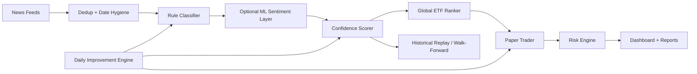

# Azalyst ETF Intelligence

Azalyst is a global ETF intelligence and paper-trading research platform. It monitors macro and market news, converts relevant events into sector signals, ranks ETF implementations across global markets, simulates position management, and publishes a live dashboard to GitHub Pages.

This repository serves as an advanced quantitative research system for generating actionable market intelligence. It is not intended as financial advice.

Live dashboard: [https://gitdhirajsv.github.io/Azalyst-ETF-Intelligence/](https://gitdhirajsv.github.io/Azalyst-ETF-Intelligence/)

## What It Does

- Scans global news feeds and direct RSS sources.
- Classifies articles into ETF-relevant sectors such as energy, defense, gold, AI, banking, crypto, India, emerging markets, and more.
- Uses a transparent confidence model with signal strength, corroboration, source quality, recency, and event intensity.
- Evaluates and ranks ETF candidates objectively across comprehensive global markets.
- Simulates paper trades with explicit fees, slippage, stops, partial profit-taking, sector caps, and reserve cash.
- Generates a static dashboard from local state for GitHub Pages.
- Replays dated historical signals through a backtester to compare results with benchmarks.
- **Integrates an autonomous LLM-driven engine** for daily self-optimization of analytical models.

## Current Architecture



## Autonomous Self-Improvement

The platform features continuous autonomous optimization. A daily scheduled pipeline executes the `self_improve.py` engine, which:

1. Reads the latest performance data — portfolio P&L, alpha vs SPY, signal accuracy, open positions
2. Reads the relevant source files — scorer, classifier, paper trader, ETF mapper
3. Calls **Qwen3 Coder 480B** via the NVIDIA NIM free API endpoint
4. Receives one targeted, validated code change
5. Applies it if it passes a syntax check and exact-match guard
6. Commits the changed file back to `main` — the next 30-minute scan runs with the improved code

Every cycle is logged to `improvement_log.jsonl` for a full audit trail whether a change was applied or not.

### Agentic Intelligence (AGENTS.md)
This repository contains an `AGENTS.md` file, which acts as the core system instruction set for the autonomous Qwen engine during its daily optimization cycles. It enforces strict engineering guidelines, ensuring the AI operates with:
- **Minimal Complexity**: Prevents unnecessary code additions and gold-plating.
- **Faithful Reporting**: Ensures the AI doesn't hallucinate test successes.
- **Actionable Execution**: Guides the AI to synthesize findings and execute targeted fixes.


### Safety Guardrails

The improvement engine can only modify these files:

- `scorer.py` — confidence scoring model
- `classifier.py` — sector keyword classifier
- `paper_trader.py` — trading logic
- `etf_mapper.py` — ETF database and ranking
- `news_fetcher.py` — RSS ingestion
- `reporter.py` — Discord formatting

Core orchestration files (`azalyst.py`, `config.py`, `risk_engine.py`) are read-only context — the engine cannot touch them. Every proposed change must match the existing code verbatim before it is applied, and is syntax-checked in a temporary file before writing to disk.

### Setup

Add your NVIDIA NIM API key as a repository secret:

```
GitHub → Settings → Secrets and variables → Actions → New repository secret
Name:  NVIDIA_API_KEY
Value: your key from build.nvidia.com
```

The free NVIDIA NIM endpoint for Qwen3 Coder 480B covers the daily volume with no cost.

## What Changed In This Version

- Global-first ETF selection:
  - ETF recommendations are now ranked across all mapped markets.
  - The engine employs rigorous objective selection rather than default list parsing.
- Better classifier behavior:
  - Word-boundary matching reduces substring false positives.
  - Directional signal scoring distinguishes bullish and bearish language.
  - Optional FinBERT-style sentiment support can run in `shadow` or `hybrid` mode.
- Better news ingestion:
  - Fuzzy title dedup reduces paraphrased duplicate articles.
  - RSS timestamps now go through basic sanity checks.
- Better scoring model:
  - Volume, source diversity, recency, and signal strength now use smooth functions instead of hard cliffs.
  - Event intensity is less circular than the old severity logic.
- Better execution realism:
  - Paper trading includes modeled fees and slippage.
  - Position sizing employs a capped risk-budget approach for institutional-grade allocation.
- Better risk math:
  - Correlation modeling dynamically filters positive correlation while preserving negative diversification benefits.
  - Benchmark inception uses the actual start date window rather than a coarse range proxy.
  - Stress testing maps assets more reliably, including gold-linked ETFs such as `GLDM`.
- Better validation:
  - Historical replay backtester added.
  - Walk-forward window summaries supported for dated signal files.
- Autonomous improvement:
  - Daily self-improvement engine added using Qwen3 Coder 480B on NVIDIA NIM.
  - Audit log maintained in `improvement_log.jsonl`.

## Key Files

- `azalyst.py`: live engine orchestration
- `self_improve.py`: daily autonomous code improvement engine
- `news_fetcher.py`: ingestion, date parsing, dedup
- `classifier.py`: rule engine plus optional ML sentiment layer
- `scorer.py`: confidence scoring
- `etf_mapper.py`: global ETF ranking and market alternatives
- `paper_trader.py`: realistic paper-trading engine
- `risk_engine.py`: correlation, benchmark, vol, rebalance, stress test
- `backtester.py`: historical replay and walk-forward evaluation
- `generate_dashboard.py`: builds `status.json`
- `index.html`: GitHub Pages dashboard
- `improvement_log.jsonl`: audit log of all daily improvement cycles

## Setup

### 1. Clone

```bash
git clone https://github.com/gitdhirajsv/Azalyst-ETF-Intelligence.git
cd Azalyst-ETF-Intelligence
```

### 2. Install Dependencies

```bash
pip install -r requirements.txt
```

### 3. Configure Environment

Create `.env` from `.env.example` and set at least your Discord webhook if you want alerts.

Example settings:

```dotenv
WEBHOOK=https://discord.com/api/webhooks/your_webhook_here
INTERVAL=30
THRESHOLD=62
COOLDOWN_HOURS=4
MIN_ARTICLES=2
MAX_ARTICLES=300
MAX_ARTICLE_AGE_DAYS=7
PAPER_TRADING=true

# Optional ML sentiment layer
ML_SENTIMENT_ENABLED=true
ML_SENTIMENT_MODE=shadow
ML_SENTIMENT_MODEL=ProsusAI/finbert
ML_SENTIMENT_MIN_CONFIDENCE=0.58

# Optional fuzzy title dedup tuning
FUZZY_TITLE_DEDUP_THRESHOLD=0.92
```

### 4. Add GitHub Secrets

Two secrets are needed for the full automated pipeline:

| Secret | Purpose |
|---|---|
| `DISCORD_WEBHOOK_URL` | Signal and portfolio alerts to Discord |
| `NVIDIA_API_KEY` | Daily self-improvement engine via NVIDIA NIM |

Add them at: GitHub → Settings → Secrets and variables → Actions

### 5. Run The Engine

```bash
python azalyst.py
```

### 6. Regenerate The Dashboard

```bash
python generate_dashboard.py
```

This writes `status.json`, which powers the GitHub Pages site.

## Backtesting And Walk-Forward

Backtesting in this project means replaying dated historical signals against historical ETF prices with modeled execution costs.

Run a replay:

```bash
python backtester.py --signals data/backtest_events.sample.jsonl
```

Run replay plus walk-forward windows:

```bash
python backtester.py --signals data/backtest_events.sample.jsonl --walk-forward-splits 3
```

Expected input format:

```json
{
  "timestamp": "2025-01-15T10:30:00Z",
  "sectors": ["technology_ai"],
  "sector_label": "Technology & AI / Semiconductors",
  "confidence": 78,
  "severity": "HIGH"
}
```

The current sample file is intentionally small. It proves the replay engine works, but it is not enough to claim robust alpha. Real validation still requires a much larger dated signal archive.

## Dashboard And Public Track Record

The GitHub Pages dashboard reads from `status.json` and shows:

- portfolio NAV, cash, drawdown, reserve state
- open and closed trades
- active signal buckets
- ranked ETF opportunities
- market snapshot
- risk controls and Aladdin-style analytics

Note: The public simulation record serves as a transparent research log for ongoing model validation.

## Design Principles

- Global first, not country siloed.
- Transparent scoring before black-box complexity.
- ML added carefully, with fallback behavior.
- Execution realism matters: costs, slippage, gaps, diversification, and volatility.
- Validation matters as much as signal generation.
- The system improves itself — human oversight is audit, not operation.

## System Scope and Limitations

- Designed for quantitative research simulation rather than live broker integration.
- Utilizes deterministic rule engines augmented by targeted ML layers.
- Focuses on signal generation and allocation heuristics rather than high-frequency execution.
- Ongoing empirical backtesting is required to establish robust, long-term alpha.

## Recommended Next Steps

- Build a larger dated signal dataset from historical news archives.
- Add benchmark-by-sector and regime-specific evaluation.
- Expand ETF metadata with live liquidity, spread, and expense-ratio feeds.
- Add a model registry for comparing rule-only vs hybrid ML variants.
- Add live monitoring around stop-gap risk and execution windows.
- Review `improvement_log.jsonl` weekly to audit what the engine changed and why.

## License

MIT
