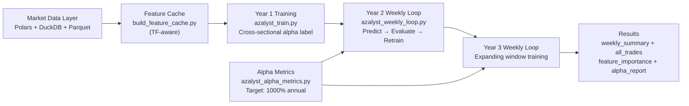

# Azalyst Alpha Research Engine

> An institutional-style quantitative research platform for crypto markets - built as a personal project. Not a hedge fund. Not a financial product. Just a passion for systematic research.

---


## Overview

Azalyst Alpha Research Engine is research infrastructure for systematic crypto market study. It is built to evaluate cross-sectional signals, neutralize obvious risk exposures, test mean-reversion and regime effects, train predictive models, and validate the resulting process with a self-improving weekly walk-forward loop.

The project is structured as a research environment rather than a product surface. It is designed for repeatable experimentation, auditability, and transparent methodology. The emphasis is on whether an observed effect survives disciplined validation — not on maximizing narrative appeal or alert volume.

**Alpha target: 1000% annual return (10x capital).** The weekly loop retrains automatically whenever the rolling 4-week annualised return falls below this target.

## Live Research Monitor

The platform includes a local monitoring layer for long-running walk-forward experiments.


---

## Bug Fixes

### v1.1 — Timeframe-Aware Feature Engineering (current)

**Problem:** All rolling-window constants (`BARS_PER_HOUR = 12`, `BARS_PER_DAY = 288`, `HORIZON_BARS = 48`) were hardcoded to 5-minute candle math. When any module processed or scored candles at a different timeframe (weekly, daily, 4H), the result was complete NaN flooding of the feature matrix — the model found no valid signal rows and either skipped silently or wasted computation.

Specifically affected features at non-5min timeframes:
- `ret_1d` — `c.shift(288)` on weekly = 288 weeks = 5.5 years back (doesn't exist → NaN)
- `rvol_1d`, `vol_ratio`, `skew_1d`, `kurt_1d`, `amihud` — same fate
- `vwap_dev` — rolling 288-bar VWAP on weekly = meaningless

**Fix:** New shared utility `azalyst_tf_utils.py` with `get_tf_constants(resample_str)` that converts any pandas resample string to semantically-correct bar counts:

```python
get_tf_constants('5min')  → bph=12,  bpd=288,  horizon=48
get_tf_constants('4h')    → bph=1,   bpd=6,    horizon=1
get_tf_constants('1D')    → bph=1,   bpd=1,    horizon=1
get_tf_constants('1W')    → bph=1,   bpd=1,    horizon=1
```

All of `build_feature_cache.py`, `azalyst_train.py`, `azalyst_weekly_loop.py`, and `walkforward_simulator.py` now accept an explicit `--resample` / `resample_freq` parameter and derive window sizes dynamically. Default behaviour (5-min → 4H resample for training) is **completely unchanged** — the fix is transparent to existing pipelines.

**Files changed:**
| File | Change |
|---|---|
| `azalyst_tf_utils.py` | **NEW** — `get_tf_constants()` utility |
| `build_feature_cache.py` | `compute_features(df, resample='5min')` — windows scale with TF |
| `azalyst_train.py` | `load_data_for_window(..., resample_freq='4h')` explicit param |
| `azalyst_weekly_loop.py` | `TRAIN_RESAMPLE = '4h'` constant; all calls explicit |
| `walkforward_simulator.py` | `resample_freq` param in `WalkForwardSimulator` and `FeatureCacheLoader` |
| `azalyst-alpha-fixed.ipynb` | Kaggle notebook — same fix applied inline |

---

## Research Scope

The platform is built around five core questions:

1. Which cross-sectional factors persist across a broad crypto universe?
2. Which signals survive after controlling for systematic exposures such as BTC beta, liquidity, and size?
3. Which relationships exhibit genuine mean reversion rather than coincidental co-movement?
4. Can machine learning models improve ranking quality without introducing obvious lookahead bias?
5. Does the full process remain credible under rolling walk-forward replay with checkpoints, fees, and retraining?

## System Architecture



## ML Pipeline

### Training Label — Cross-Sectional Alpha

The model does **not** predict whether a coin goes up or down. It predicts whether a coin will **outperform the cross-sectional median** return across all coins at that timestamp. This means:

- The signal is direction-agnostic — it works in bull and bear markets equally
- The model learns relative strength, not absolute price movement
- This is how institutional quant funds build signals

### Self-Improving Weekly Loop

```
YEAR 1 DATA  (365 days)
    ↓
[INITIAL TRAIN]
LightGBM + purged time-series CV
Cross-sectional alpha labels
    ↓
YEAR 2 DATA  (week by week)
    ↓
┌─────────────────────────────────────────────────────┐
│  Each week:                                         │
│    1. Predict  — rank symbols by outperformance prob│
│    2. Trade    — long top 20%, short bottom 20%     │
│    3. Evaluate — rolling 4-week annualised return   │
│    4. Decide   — if < 1000% annual → RETRAIN        │
│       Expanding window: Year 1 + all weeks seen     │
│    5. Save     — weekly summary + all trades        │
└─────────────────────────────────────────────────────┘
    ↓
YEAR 3 DATA  (same loop continues)
    ↓
RESULTS  →  send to Claude for improvement suggestions
```

### Retrain Trigger

| Condition | Action |
|---|---|
| Rolling 4-week annualised < 1000% | Retrain on expanded window |
| Single week return < -15% | Immediate retrain |
| On track (>= 1000% annualised) | Keep predicting, no retrain |

## Execution Modes

### Option 1 — Local pipeline

```bash
# Step 1: Build feature cache (run once)
python build_feature_cache.py --data-dir ./data --out-dir ./feature_cache

# Step 2: Train on Year 1
python azalyst_train.py --feature-dir ./feature_cache --out-dir ./results

# Step 3: Run weekly self-improving loop (Year 2 + Year 3)
python azalyst_weekly_loop.py --feature-dir ./feature_cache --results-dir ./results

# With GPU (recommended)
python azalyst_train.py --feature-dir ./feature_cache --out-dir ./results --gpu
python azalyst_weekly_loop.py --feature-dir ./feature_cache --results-dir ./results --gpu
```

### Option 2 — Kaggle (GPU, faster)

1. Create a new Kaggle notebook
2. Set accelerator to **GPU T4 x2**
3. Upload all Python files and your dataset
4. Use `azalyst-alpha-fixed.ipynb` — the fully fixed Kaggle notebook
5. Download `results.zip` from the output tab

Expected runtime with T4 GPU: **3–5 hours** for full 3-year pipeline.

### Option 3 — GitHub Actions (automated CI/CD)

Push to `main` branch and the workflow runs automatically. Set three secrets in your repo:

| Secret | Value |
|---|---|
| `KAGGLE_USERNAME` | Your Kaggle username |
| `KAGGLE_KEY` | Your Kaggle API key |
| `KAGGLE_DATASET` | `username/dataset-name` |

Results are saved as downloadable artifacts for 30 days after each run.

See `SETUP.md` for full setup instructions for both Kaggle and GitHub Actions.

### Option 4 — Core research pipeline only

```bash
python azalyst_orchestrator.py --data-dir ./data --out-dir ./azalyst_output
```

```bash
python walkforward_simulator.py
```

## Repository Map

| Path | Purpose |
| --- | --- |
| `azalyst_tf_utils.py` | **NEW** Timeframe utility — `get_tf_constants(resample_str)` |
| `azalyst_alpha_metrics.py` | Alpha calculator — 1000% annual target, retrain trigger logic. |
| `azalyst_train.py` | Year 1 training — cross-sectional alpha labels, LightGBM + purged CV. |
| `azalyst_weekly_loop.py` | Year 2+3 weekly self-improving loop — predict, evaluate, retrain. |
| `kaggle_pipeline.py` | Full GPU pipeline runner for Kaggle notebooks. |
| `azalyst-alpha-fixed.ipynb` | Fixed Kaggle notebook — timeframe-aware feature engineering. |
| `build_feature_cache.py` | Precompute ML features once — 5-20x simulation speedup. |
| `azalyst_orchestrator.py` | End-to-end research pipeline entry point. |
| `azalyst_data.py` | High-performance Polars and DuckDB analytics layer. |
| `azalyst_factors_v2.py` | Cross-sectional factor library (35 factors). |
| `azalyst_validator.py` | Style neutralization and institutional validation. |
| `azalyst_statarb.py` | Cointegration and mean-reversion research. |
| `azalyst_ml.py` | Predictive models, feature engineering, and regime logic. |
| `azalyst_signal_combiner.py` | Weighted signal fusion layer. |
| `walkforward_simulator.py` | Rolling walk-forward backtest and checkpointing. |
| `monitor_dashboard.py` | Browser-based monitor server (`http://127.0.0.1:8080`). |
| `Azalyst_Live_Monitor.ipynb` | Jupyter-based live monitor. |
| `.github/workflows/azalyst_training.yml` | GitHub Actions CI/CD workflow. |
| `SETUP.md` | Full setup instructions for Kaggle and GitHub Actions. |

## Data Requirements

Place Binance 5-minute parquet files in `data/` with the schema below:

```text
timestamp | open | high | low | close | volume
```

The platform is intended for broad, cross-sectional research universes and multi-year history.

## Installation

```bash
pip install -r requirements.txt
```

### Optional notebook monitoring

```bash
pip install notebook ipykernel
```

## Primary Outputs

| File | Description |
| --- | --- |
| `results/weekly_summary_all.csv` | Week-by-week return, Sharpe, retrain flag across Year 2+3. |
| `results/all_trades_all.csv` | Every simulated trade across the full 2-year loop. |
| `results/alpha_report.json` | Summary report — annualised return, total retrains, alpha achieved. |
| `results/feature_importance_*.csv` | Feature importance at Year 1 and after each retrain. |
| `results/models/model_*.pkl` | Model checkpoint after each retrain. |
| `results/train_summary.json` | Year 1 training metadata — AUC, symbols, rows. |

## Research Principles

- Transparent methodology over opaque claims.
- Validation before interpretation.
- Repeatable pipelines over discretionary workflows.
- Results treated as evidence, not promises.
- No LLM in the training loop — pure quantitative self-improvement.

## Disclaimer

Azalyst is a personal research and learning project. It is not a financial service, not a trading product, and not investment advice. Any use of the code, models, or outputs is entirely at the user's own risk.

---

<div align="center">
Built by <a href="https://github.com/gitdhirajsv">Azalyst</a>
</div>
