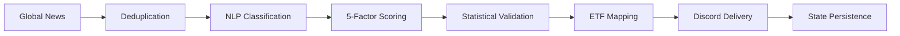

# Azalyst ETF Intelligence

> An institutional-style quantitative research platform built as a personal project. Not a hedge fund. Not a financial product. Just a passion for systematic research.
> 
> **Aladdin-grade Risk Engine**: Institutional portfolio analytics — correlation matrix, benchmark alpha, volatility-adjusted sizing, systematic rebalancing, and multi-scenario stress testing.

---

## Overview

Azalyst ETF Intelligence is a research infrastructure project for monitoring global news, classifying macro developments into investable sectors, and routing only the highest-conviction observations into a structured alert workflow. It is designed as a disciplined research system rather than a financial product, broker integration layer, or automated trading stack.

At a high level, the platform scans global news feeds, deduplicates and clusters related articles, applies a lightweight NLP-style sector classifier, computes a transparent five-factor confidence score, maps validated sector signals to ETFs across global markets (NYSE, NASDAQ, NSE, BSE), and delivers structured reports to Discord. Every cycle is logged locally, and signal state is persisted so the system can enforce cooldowns, detect stronger updates, and maintain an audit trail across runs.

The system is fully **USD-denominated** — all portfolio values, P&L, and capital tracking display in US dollars with INR shown as a secondary reference. ETF platform information is displayed dynamically, showing which brokers offer each instrument (e.g., "iShares by BlackRock — IBKR / Schwab / Fidelity" for US ETFs, "NSE/BSE listed — Zerodha / Dhan / Groww" for Indian ETFs). Access via IBKR, Schwab, Fidelity, INDmoney, Vested, Dhan, Groww, or Zerodha.

The project exists for a simple reason: global macro events move faster than discretionary monitoring can reliably keep up with, yet most headline streams are too noisy to act on directly. Azalyst attempts to bridge that gap with disciplined filtering. The system is opinionated about what should qualify as a signal, conservative about what deserves distribution, and explicit about why a given alert cleared the bar.

## Dashboard Preview

Live monitor output (generated from the current portfolio/state artifacts):


Core capabilities:

- Global news scanning through **[WorldMonitor](https://github.com/koala73/worldmonitor)** and direct RSS feeds.
- Sector classification across 14+ research buckets using weighted keyword rules, negation handling, and article clustering.
- Five-factor confidence scoring with transparent component breakdowns.
- ETF opportunity mapping across NYSE, NASDAQ, NSE, and BSE with dynamic broker platform display.
- **USD-first dashboard** with dark theme, dual-currency display, and Global Opportunity Monitor.
- **50/50 monthly reserve** — half of each deposit is held for high-conviction opportunities.
- **Compare-before-deploy** — new signals are ranked against existing positions before capital allocation.
- Structured Discord delivery via **[Discord Webhooks](https://discord.com/developers/docs/resources/webhook)**.
- Local state persistence and log-based auditability.
- **Aladdin Risk Engine** — correlation matrix, benchmark tracking (SPY alpha), vol-adjusted sizing, rebalance drift monitor, and stress testing across 5 scenarios.

Research controls:

- Conservative delivery threshold: `62+` confidence.
- Minimum corroboration requirement: `2+` relevant articles.
- Cooldown mechanism: `4` hours per tracked signal basket.
- Article age filter: drops articles older than `7 days` (configurable).
- Update logic: stronger signals can re-issue before cooldown expiry if confidence improves materially.
- Audit trail logging through `azalyst.log` and persisted sector state in `azalyst_state.json`.

Primary dependencies:

- **[Python 3.9+](https://www.python.org/downloads/)**
- **[WorldMonitor](https://github.com/koala73/worldmonitor)**
- **[requests](https://pypi.org/project/requests/)**
- **[feedparser](https://pypi.org/project/feedparser/)**
- **[schedule](https://pypi.org/project/schedule/)**
- **[python-dateutil](https://pypi.org/project/python-dateutil/)**
- **[python-dotenv](https://pypi.org/project/python-dotenv/)**

---

## Live Track Record — Public & Verifiable

This project runs a fully transparent, forward-tested paper trading experiment on GitHub Actions.

Every 30 minutes, the system automatically:
- Scans global news and detects macro signals
- Enters paper trades based on those signals
- Marks all open positions to market with live prices
- Commits every update back to this repository with a timestamp

**No data is hidden, adjusted, or cherry-picked.** Every trade entry, price update, stop-loss exit, and P&L change is permanently recorded in `azalyst_portfolio.json` with a full git history. Anyone can click **History** on that file and verify every single transaction from day one.

| | |
|---|---|
| **Experiment started** | April 2026 |
| **Monthly capital** | $10,000 USD / month (auto-credited) |
| **Capital strategy** | 50% deployed immediately, 50% held in reserve |
| **Total after 6 months** | $60,000 deposited |
| **Stop-loss** | −10% per position |
| **Max hold period** | 180 days |
| **Max open positions** | 6 at a time |
| **Currency** | USD primary, INR secondary |

**Live dashboard (updates every 30 min):**
https://gitdhirajsv.github.io/Azalyst-ETF-Intelligence/

The dashboard shows current portfolio value, open positions with live P&L, closed trade history, win rate, and overall return vs capital deposited.

**The goal:** After 6 months, does this system outperform a simple S&P 500 index fund? If yes, the signal model has demonstrated real edge and real capital deployment becomes worth considering. If not, the experiment saved real money and identified what needs improvement — which is exactly what paper trading is for.

---

## System Flow



`Statistical Validation` in this context refers to corroboration counts, source diversity checks, recency decay, severity weighting, threshold enforcement, and cooldown-aware update logic. The objective is to suppress noise rather than maximize alert volume.

## Installation

### 1. Clone the repository

```bash
git clone https://github.com/gitdhirajsv/Azalyst-ETF-Intelligence.git
cd Azalyst-ETF-Intelligence
```

### 2. Install dependencies

```bash
pip install -r requirements.txt
```

### 3. Configure `.env`

Copy the example file and set your Discord webhook:

```bash
cp .env.example .env
```

```dotenv
WEBHOOK=https://discord.com/api/webhooks/your_webhook_here
INTERVAL=30
THRESHOLD=62
COOLDOWN_HOURS=4
MIN_ARTICLES=2

# Optional advanced controls
UPDATE_HOURS=2
UPDATE_DELTA=10
PAPER_TRADING=true
EOD_REPORT_HOUR=15
EOD_REPORT_MINUTE=30
MTM_INTERVAL=60
MAX_ARTICLES=300
MAX_ARTICLE_AGE_DAYS=7
LOG_LEVEL=INFO
```

### 4. Run the system

```bash
python azalyst.py
```

### Windows Launcher

```bat
Azalyst_Spyder.bat
```

This is the single launcher for the project. It starts the engine in a command prompt and optionally opens Spyder with the live monitor. If the Spyder window is closed, the engine keeps running.

---

## Aladdin Risk Engine

Inspired by BlackRock's Aladdin platform, Azalyst now includes an institutional-grade risk analytics engine (`risk_engine.py`) that runs on every dashboard refresh and trading cycle.

### 5 Institutional Features

| Feature | What It Does | Threshold |
|---|---|---|
| **Correlation Matrix** | 30-day rolling pairwise Pearson correlation across all open positions. Blocks new entries if max correlation exceeds threshold. | Block > 0.80, Warn > 0.60 |
| **Benchmark Tracking** | Tracks SPY total return from portfolio inception date. Computes alpha (portfolio return − benchmark return). | — |
| **Vol-Adjusted Sizing** | Fetches 30-day realised volatility per ETF. Scales position size inversely — high-vol ETFs get smaller allocations (clamped 0.3x–2.0x). | Target vol: 15% annualised |
| **Systematic Rebalancing** | Equal-weight target (90% equity / 10% cash). Flags any position drifting beyond threshold from target weight. | Drift > ±5% |
| **Stress Testing** | Runs portfolio through 5 historical/hypothetical shock scenarios. Maps each ETF to a factor (equities, gold, oil, crypto) and computes P&L impact. | — |

### Stress Test Scenarios

| Scenario | Equities | Gold | Oil | Crypto |
|---|---|---|---|---|
| 2008 GFC | −40% | +25% | −55% | −60% |
| 2020 COVID | −34% | +3% | −65% | −40% |
| Rates +2% | −15% | −5% | −10% | −20% |
| USD +10% | −8% | −12% | −15% | −10% |
| VIX Spike 40 | −18% | +8% | −20% | −25% |

### Integration Points

- **`paper_trader.py`** — Correlation gate blocks overly-correlated entries. Vol-adjusted sizing scales allocation. Rebalance alerts logged during mark-to-market.
- **`generate_dashboard.py`** — Full risk report included in `status.json` under `aladdin_risk` field.
- **`index.html`** — Dedicated "ALADDIN RISK ENGINE" panel on the Market Data tab showing correlation heatmap, volatility bars, stress test table, benchmark alpha, and rebalance alerts.

### Dashboard Panel

The Aladdin panel displays:
- **Stats row**: SPY benchmark return, Alpha vs SPY, Portfolio volatility, Max correlation
- **Correlation matrix**: Color-coded heatmap (red > 0.80, orange > 0.60, yellow > 0.30)
- **Volatility bars**: Per-ETF annualised vol with target line
- **Stress test table**: All 5 scenarios with portfolio-level $ impact, loss %, and worst-hit position
- **Rebalance monitor**: Drift alerts with TRIM/ADD recommendations and dollar amounts

---

## Configuration

### Core Settings

| Parameter | Default | Type | Description |
|---|---:|---|---|
| `WEBHOOK` | Required | `string` | Discord webhook for structured report delivery. Also supports `AZALYST_DISCORD_WEBHOOK`. |
| `INTERVAL` | `30` | `integer` | Scan interval in minutes. Also supports `AZALYST_INTERVAL`. |
| `THRESHOLD` | `62` | `integer` | Minimum confidence score before a signal is delivered. Also supports `AZALYST_THRESHOLD`. |
| `COOLDOWN_HOURS` | `4` | `integer` | Minimum hours between alerts on the same sector. Also supports `AZALYST_COOLDOWN_HOURS`. |
| `MIN_ARTICLES` | `2` | `integer` | Minimum corroborating articles to form a signal. Also supports `AZALYST_MIN_ARTICLES`. |

### Risk Engine Parameters

These are configured in `risk_engine.py` and `paper_trader.py`:

| Parameter | Default | Description |
|---|---:|---|
| `CORRELATION_BLOCK_THRESHOLD` | `0.80` | Block new entry if max pairwise correlation exceeds this |
| `CORRELATION_WARN_THRESHOLD` | `0.60` | Dashboard warning level |
| `TARGET_VOL` | `15%` | Target annualised volatility for position scaling |
| `REBALANCE_DRIFT_PCT` | `5%` | Trigger rebalance alert if position drifts beyond this |
| `MAX_SINGLE_POSITION_PCT` | `22%` | Hard cap on any single position |
| `PARTIAL_PROFIT_PCT` | `8%` | Take 50% profit at this return threshold |
| `ROTATION_MIN_HOLD_DAYS` | `14` | Minimum days before position eligible for rotation |

## Confidence Score Model

Each signal is assigned a score from `0` to `100` as the sum of five deterministic components. No hidden weighting or opaque model calibration is used.

| Factor | Max Points | Description |
|---|---:|---|
| Signal Strength | `25` | Weighted keyword relevance across clustered articles. |
| Volume Confirmation | `20` | Number of corroborating articles supporting the same theme. |
| Source Diversity | `20` | Independent source confirmation, tiered by outlet credibility. |
| Recency | `20` | Freshness of the most recent supporting article. |
| Geopolitical Severity | `15` | Event severity and regional macro impact. |

Example: `Strait of Hormuz airstrike = 92/100`

| Factor | Score | Rationale |
|---|---:|---|
| Signal Strength | `23/25` | Strong keyword density around airstrike, oil supply, shipping lanes. |
| Volume Confirmation | `16/20` | Seven corroborating articles across the event cluster. |
| Source Diversity | `18/20` | Multiple independent sources including top-tier international outlets. |
| Recency | `20/20` | Latest article published within the last hour. |
| Geopolitical Severity | `15/15` | Critical event in a high-impact energy corridor. |
| **Total** | **`92/100`** | High-conviction signal. |

## Sector Coverage

| Sector | India (NSE/BSE) | Global (NYSE/NASDAQ) |
|---|---|---|
| Energy & Oil | `CPSEETF`, `PSUBNKBEES` | `XLE`, `USO`, `IXC` |
| Defense & Aerospace | `DEFENCEETF`, `CPSEETF` | `ITA`, `XAR`, `PPA` |
| Precious Metals | `GOLDBEES`, `HDFCGOLD` | `GLDM`, `GDX`, `GDXJ` |
| Technology & AI | `MAFANG`, `NIFTYBEES` | `SOXX`, `QQQ`, `AIQ` |
| Nuclear & Uranium | `CPSEETF` | `URNM`, `URA`, `SRUUF` |
| Cybersecurity | `—` | `HACK`, `CIBR` |
| Broad India Equity | `NIFTYBEES`, `MIDCAPETF` | `INDA` |
| Banking & Finance | `BANKBEES` | `XLF`, `GLDM` |
| Commodities | `CPSEETF` | `DBC`, `COPP` |
| Emerging Markets | `NIFTYBEES` | `EEM`, `SPEM` |
| Cryptocurrencies | `—` | `IBIT`, `BITQ` |

**Broker flexibility:** The system displays ETFs with their available trading platforms:
- **US ETFs**: NYSE/NASDAQ listed — tradable via IBKR, Schwab, Fidelity, or any international broker
- **India ETFs**: NSE/BSE listed — tradable via INDmoney, Vested, Zerodha, Dhan, Groww, or any Indian broker

Each Discord report shows the exact platform information (e.g., "iShares by BlackRock — IBKR / Schwab / Fidelity") so you know where each ETF is available.

**Capital management:**
- Each monthly $10,000 deposit is split 50/50 — half deployed immediately, half held in reserve.
- Reserve is released only when a new signal scores higher than all existing open positions.
- If no new signal beats existing positions, capital tops up the strongest current holding.
- This ensures capital flows only toward the highest-conviction opportunities.

## File Structure

```text
.
|-- azalyst.py                    # Main engine
|-- Azalyst_Spyder.bat            # Windows launcher
|-- start_azalyst.bat             # Auto-startup script
|-- install_autostart.bat         # Auto-start installer
|-- setup_windows_startup.ps1     # Task Scheduler setup
|-- config.py                     # Configuration
|-- news_fetcher.py               # RSS feed fetching
|-- classifier.py                 # Sector classification
|-- scorer.py                     # Confidence scoring
|-- etf_mapper.py                 # ETF mapping
|-- reporter.py                   # Discord reporting
|-- state.py                      # State management
|-- spyder_live_monitor.py        # Live dashboard
|-- paper_trader.py               # Paper trading engine
|-- portfolio_reporter.py         # Portfolio reporting
|-- generate_dashboard.py         # Dashboard generation
|-- risk_engine.py                # Aladdin risk engine (correlation, vol, stress)
|-- migrate_portfolio_platforms.py # Platform migration utility
|-- migrate_state_platforms.py    # State migration utility
|-- prepare_spyder_profile.py     # Spyder profile setup
|-- requirements.txt              # Python dependencies
|-- .env.example                  # Environment template
|-- .env                          # Your configuration (not committed)
|-- README.md                     # Main documentation
|-- AUTO_STARTUP_GUIDE.md         # Auto-startup setup guide
|-- GLOBAL_ETF_PLATFORM_FIX.md   # Platform mapping docs
|-- FOLDER_STRUCTURE.txt          # File listing reference
|-- index.html                    # Dashboard HTML
|-- dashboard.js                  # Dashboard JavaScript
|-- dashboard_12pct.png           # Dashboard preview image
|-- LICENSE                       # MIT License
+-- data/                         # Data directory
+-- .github/workflows/            # GitHub Actions CI
    +-- run_azalyst.yml           # 30-min auto-run workflow
+-- runtime artifacts (auto-generated)
    |-- azalyst.log               # System logs
    |-- azalyst_state.json        # Signal state
    |-- azalyst_portfolio.json    # Portfolio data
    +-- status.json               # Dashboard status file
```

All files are in the **same folder** for easy access. No subfolders needed!

## Usage Examples

```bash
# Run continuously
python azalyst.py

# Single cycle mode (GitHub Actions)
python azalyst.py --once

# Custom confidence threshold
AZALYST_THRESHOLD=70 python azalyst.py

# Extended cooldown
AZALYST_COOLDOWN_HOURS=8 python azalyst.py

```

## Troubleshooting

### General Issues

- **No alerts firing:** confirm `WEBHOOK` is set, inspect `azalyst.log`, temporarily lower threshold to 50 to test end-to-end delivery.
- **Too many alerts:** raise `THRESHOLD`, increase `COOLDOWN_HOURS`.
- **News not loading:** check internet, try without VPN, inspect feed errors in `azalyst.log`.

## Architecture Notes

### Design principles

The system is built around transparent research mechanics. Classification is rule-based and inspectable. Scoring is additive and deterministic. Thresholds are explicit. State persistence is local and human-readable. Every alert is explainable after the fact.

The platform is signal-first rather than price-first. It does not predict intraday microstructure, route orders, or construct a portfolio frontier. Its role is upstream: identifying macro developments early, framing them consistently, and presenting a disciplined starting point for human review.

### Known limitations

- Feed quality and timing are constrained by upstream sources.
- The classifier is robust for obvious macro themes but subtle context remains a hard problem for rule-based systems.
- ETF mapping is a research convenience layer, not a guarantee of availability or suitability.
- The system does not backtest signal efficacy or model transaction costs.

## Attribution

**[WorldMonitor](https://github.com/koala73/worldmonitor)** by [@koala73](https://github.com/koala73) provides the foundation for global news aggregation.

## License

Released under the **MIT License**. See `LICENSE`.

## Disclaimer

This is a personal research and learning project. Azalyst is not a financial service, investment advisor, or trading algorithm. Nothing here is financial advice. Use entirely at your own risk. Past signal performance does not guarantee future results. Consult a qualified financial advisor before making investment decisions.

<div align="center">

Built by [Azalyst](https://github.com/gitdhirajsv) | Azalyst Quant Research

</div>
