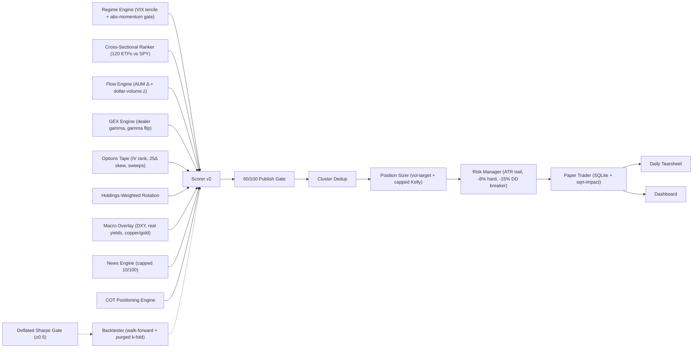

# Azalyst-ETF-Intelligence

Azalyst is an advanced quantitative research platform designed to capture global sector rotations through multi-engine signal fusion. By synthesizing high-entropy news data, real-time price action, institutional positioning (COT), and deep-holdings analysis, Azalyst provides an objective, cross-validated edge for global ETF strategy execution.

The platform operates a fully autonomous, serverless pipeline from discovery to risk-adjusted simulation, delivering actionable macro intelligence in an institutional research format.

Live Intelligence Dashboard: [https://gitdhirajsv.github.io/Azalyst-ETF-Intelligence/](https://gitdhirajsv.github.io/Azalyst-ETF-Intelligence/)

## The Azalyst Edge

- **Multi-Engine Signal Fusion**: Operates seven independent analytical layers (Cross-Sectional Rank, ETF Flow, Dealer GEX, Options Tape, Holdings-Weighted Rotation, Macro Fit, News) to achieve statistical consensus before capital deployment.
- **Regime-Conditional Weighting**: Factor budgets shift between LOW / MID / HIGH volatility regimes based on a VIX-tercile classifier, with an absolute-momentum gate that only allows long signals on defensives in `RISK_OFF` tape.
- **Institutional Execution Fidelity**: Models slippage (half-spread + square-root market impact), tiered fees (including India-specific STT/GST), bid-ask spreads, and liquidity constraints with Citadel-grade realism.
- **Price-Led discovery**: Prioritizes structural price breakouts and dealer positioning as the primary discovery vectors, using the news cycle as a secondary confirmation layer (capped at 10/100 in scoring), never the reverse.
- **High-Fidelity Filtering**: Employs domain-authority weighting and temporal burst detection to isolate signal from syndicated noise, plus correlation-cluster dedup so SOXX, SMH, and SOXL do not double-count as three independent positions.

## Supported Sectors

The classification engine actively monitors and routes signals across these intelligence categories:

- Energy / Oil & Gas
- Defense & Aerospace
- Gold & Precious Metals
- Technology & AI / Semiconductors
- Nuclear Energy & Uranium
- Cybersecurity
- Crypto & Digital Assets
- Banking & Financial Sector
- Commodities & Mining
- Emerging Markets
- Asia-Pacific & Europe regional ETFs

## Architecture

```
 ╔══════════════════════════════════════════════════════════════════╗
 ║                  AZALYST ETF INTELLIGENCE                        ║
 ║                  global alpha · free data · paper-traded         ║
 ╚══════════════════════════════════════════════════════════════════╝

           ┌── CRON ──┐
           │  30 min  │
           └────┬─────┘
                │
       ┌────────┴────────┐
       ▼                 ▼
 ┌────────────┐   ┌─────────────────────┐
 │ NEWS       │   │ UNIVERSE FETCHER    │
 │ ──────     │   │ ──────────────────  │
 │ 80+ RSS    │   │ NASDAQ Trader live  │
 │ classify   │   │ 5,000  →  1,500     │
 │ score/sect │   │ liquidity-filtered  │
 └─────┬──────┘   └─────────┬───────────┘
       │                    │
       └────────┬───────────┘
                ▼
 ┌──────────────────────────────────────────┐
 │            REGIME ENGINE                 │
 │  ─────────────────────────────────────── │
 │  RISK_ON / RISK_OFF · VIX tercile        │
 │  → factor weight matrix                  │
 │  Antonacci: defensives only on RISK_OFF  │
 └────────────────┬─────────────────────────┘
                  │
                  ▼
 ╭──────────────────────────────────────────╮
 │   ▌▌▌  6-LAYER SCORING (per ETF)  ▌▌▌    │
 ├──────────────────────────────────────────┤
 │   ①  RANK      cross-sectional      / 25 │
 │   ②  FLOW      dollar-vol z-score   / 20 │
 │   ③  OPTIONS   GEX + IV + sweeps    / 20 │
 │   ④  ROTATION  AUM-weighted top-10  / 15 │
 │   ⑤  MACRO     DXY · yields · HG=F  / 10 │
 │   ⑥  NEWS      sector confidence    / 10 │
 ╰──────────────────┬───────────────────────╯
                    │
                    ▼   gate ≥ 60 / 100
 ┌──────────────────────────────────────────┐
 │  CLUSTER DEDUP                           │
 │  (kills SOXX + SMH + SOXL triple-count)  │
 └──────────────────┬───────────────────────┘
                    ▼
 ┌──────────────────────────────────────────┐
 │  VOL-TARGET SIZER                        │
 │  notional ∝ 1/σ · cap 15% · 1.5× gross   │
 └──────────────────┬───────────────────────┘
                    ▼
 ┌──────────────────────────────────────────┐
 │  RISK OVERLAY                            │
 │  ATR(14) trail · −8% hard · −15% DD brk  │
 └──────────────────┬───────────────────────┘
                    ▼
 ┌──────────────────────────────────────────┐
 │  COMMIT BOOK (idempotent)                │
 │  open │ close │ resize │ no-op           │
 └─────┬────────────────────┬───────────────┘
       │                    │
       ▼                    ▼
 ┌──────────┐         ┌─────────────────┐
 │ DISCORD  │         │   DASHBOARD     │
 │ ──────── │         │   ─────────     │
 │ ENTRY ⚡ │         │  regime banner  │
 │ EXIT  ⚡ │         │  factor breakdwn│
 │ news    │         │  leaderboard    │
 │ digest  │         │  positions      │
 └──────────┘         └─────────────────┘
                              │
                              ▼
              gh-pages publish status.json
```

The mermaid version below is the same flow rendered live by GitHub:




## Autonomous Self-Improvement

> **DEPRECATED.** The legacy `self_improve.py` LLM-driven weight-tuning loop has been disabled because tuning parameters against historical P&L is functionally indistinguishable from p-hacking; the 2pp rollback rule does not protect against multi-trial inflation. Parameter changes are now subject to walk-forward validation and a deflated-Sharpe gate (López de Prado, 2014) before deployment.
>
> The cron schedule on `daily_improve.yml` has been removed; the workflow is preserved as `workflow_dispatch` only and exits 0 with a deprecation message.

Replacement validation pipeline:

1. `azalyst_alpha/backtester.py` runs walk-forward (252-day train / 63-day test, rolling).
2. `azalyst_alpha/deflated_sharpe.py` adjusts the realized Sharpe for trial inflation, return skew, and excess kurtosis.
3. A change is only deployable if `DSR ≥ 0.5` (i.e. ≥ 70% probability the edge is real, not noise from running multiple parametrizations).

## What Changed In This Version

- **Scorer rebuilt (`scorer_v2.py`)**: replaces the 88/100-news, 12/100-cross-engine budget that mathematically blocked tape-led movers. New budget: Cross-Sectional Rank 25, Flow 20, Options + GEX 20, Holdings-Weighted Rotation 15, Macro Fit 10, News 10. Publish threshold lowered from 62 to **60**. Any 3 of {rank, flow, options, rotation} can clear the gate independently; news alone cannot.
- **Cross-Sectional Ranker (`cross_sectional_ranker.py`)**: replaces the per-asset z-score in `price_scanner.py`. Ranks ~120 ETFs by 5D / 20D / 60D risk-adjusted return, residualized against SPY, with rank-stability streak detection. Generates the leaderboard view directly.
- **Flow Engine (`flow_engine.py`)**: adds ETF creation/redemption proxy via shares-outstanding × dollar-volume z-score divergence vs. price action. Catches institutional flow before tape confirmation (the leading indicator on SLV / GLD / semiconductor ETFs).
- **GEX Engine (`gex_engine.py`)**: dealer gamma exposure computed from yfinance option chains and Black-Scholes (Squeeze Metrics methodology, 2017). Outputs total dealer GEX, gamma-flip strike, largest call wall, and largest put wall — the SpotGamma equivalent built from public chains.
- **Options Tape (`options_tape.py`)**: call/put dollar-volume ratio, ATM IV, IV rank vs. realized vol, 25-delta risk reversal skew, and unusual options activity sweep detector (volume > existing OI on individual strikes).
- **Holdings-Weighted Rotation (`holdings_weighted_rotation.py`)**: replaces the equal-weighted top-10 rule in `constituent_analyzer.py`. Conviction is computed from `Σ(weight_i × ret_5d_i × sign)`, with a fraction-of-weight (not fraction-of-count) threshold of 0.30. Captures concentrated mega-cap-driven moves on IGV (MSFT/ORCL ~16%) and SOXX (NVDA/AVGO ~18%) that the count-based rule was missing.
- **Macro Overlay (`macro_overlay.py`)**: per-ETF cross-asset regime fit. Each ETF carries a tailwind map (e.g., SLV ↔ DXY −, US10Y −, GC=F +; EWY ↔ DXY −, HG=F +, VIX −) and the engine computes a composite fit score in [-1, +1] that contributes to the macro factor budget.
- **Cluster Dedup (`cluster_dedup.py`)**: hierarchical clustering on 60-day return correlation matrix, distance = `√(2(1−ρ))`. Before publishing, the engine keeps the highest-scoring ticker per correlation cluster, eliminating the SOXX + SMH + SOXL triple-count.
- **Regime Engine (`regime_engine.py`)**: combines a VIX-tercile classifier (LOW / MID / HIGH against trailing 1Y) with an Antonacci absolute-momentum gate (SPY > 200MA AND SPY 3M return > 3M T-bill ⇒ `RISK_ON`; otherwise `RISK_OFF` allows only defensives). Each regime drives a different scorer weight matrix, recognizing that momentum half-life and signal efficacy change with the volatility regime.
- **Position Sizing (`position_sizer.py`)**: vol-target sizing where each position contributes equal annualized $-vol to the book, with a per-position 15% cap and 1.5× max gross leverage. Capped Kelly (1/4-Kelly) available for high-confidence signals.
- **Risk Overlay (`risk_manager.py`)**: ATR(14) chandelier trailing stop at 2.5× from peak, hard stop at −8% from entry, and a portfolio-level −15% drawdown circuit breaker that flattens non-defensives with a 7-day cool-down before re-entry. Vol-target rebalance bands at 0.7×–1.4× target.
- **Backtester (`azalyst_alpha/backtester.py`)**: walk-forward (rolling 252-day train, 63-day test) plus purged k-fold cross-validation with a 5-day embargo around test folds, per López de Prado AFML ch. 7.
- **Deflated Sharpe Gate (`deflated_sharpe.py`)**: adjusts realized Sharpe for trial inflation, skew, and excess kurtosis. Strategy variants only deploy when `DSR ≥ 0.5`. The full strategy auto-pauses when realized rolling-6M DSR drops below 0.4 pending re-validation.
- **Paper Trader (`azalyst_alpha/paper_trader.py`)**: SQLite-backed trade log with realistic fills — half-spread (5 bps default) plus square-root-rule market impact (`0.10 × √(notional / 30D ADV)` bps). Persisted positions, trades, and equity curve at `data/paper_trader.db`.
- **Daily Tearsheet (`report.py`)**: markdown report at `data/tearsheet.md` covering regime banner, top-25 leaderboard, published book with gross/net exposure, live positions, and equity curve.
- **`self_improve.py` deprecated**: the LLM-driven weight-tuning cron is removed. All future parameter changes route through walk-forward + deflated-Sharpe gate.
- **Paper trading reset**: portfolio re-initialized to 948,800 INR cash / 0 positions / 0 trades on v2 inception. The prior v1 paper-trading record is archived at `archive/v1_paper_track_record_2026-05-08/` for reference.
- **Dashboard updates**: regime banner (risk state, vol regime, VIX percentile, SPY vs 200MA, 3M excess vs T-bill, active weight matrix), factor breakdown panel showing per-layer points for the top published signal, threshold display updated 62 → 60, and a v2-inception tag.

## Key Files

### Core Engine (v2)
- `azalyst_alpha/cross_sectional_ranker.py`: universe-wide risk-adjusted return ranking
- `azalyst_alpha/flow_engine.py`: ETF flow proxy via shares-out × dollar-volume divergence
- `azalyst_alpha/gex_engine.py`: dealer gamma exposure from Black-Scholes on option chains
- `azalyst_alpha/options_tape.py`: IV rank, skew, sweep detection, C/P dollar-volume
- `azalyst_alpha/holdings_weighted_rotation.py`: AUM-weighted constituent rotation
- `azalyst_alpha/macro_overlay.py`: per-ETF cross-asset regime fit
- `azalyst_alpha/cluster_dedup.py`: correlation-cluster gating to prevent double-counting
- `azalyst_alpha/regime_engine.py`: VIX-tercile + absolute-momentum regime classifier
- `azalyst_alpha/scorer_v2.py`: replacement scorer (60/100 publish gate)
- `azalyst_alpha/position_sizer.py`: vol-target + capped Kelly sizing
- `azalyst_alpha/risk_manager.py`: trailing stops + drawdown circuit breaker
- `azalyst_alpha/portfolio_constructor.py`: end-to-end signal → sized book pipeline
- `azalyst_alpha/backtester.py`: walk-forward + purged k-fold validator
- `azalyst_alpha/deflated_sharpe.py`: López de Prado DSR publication gate
- `azalyst_alpha/paper_trader.py`: SQLite paper trader with realistic frictions
- `azalyst_alpha/report.py`: daily markdown tearsheet generator
- `azalyst_alpha/fusion.py`: end-to-end orchestrator (regime → scoring → dedup → sizing → tearsheet)

### Legacy / v1 Modules (still present, roles adjusted)
- `azalyst.py`: live engine orchestration (multi-engine stack: news, price, constituents, COT)
- `config.py`: global configuration, sector definitions, and RSS feed registry
- `state.py`: persistence layer for portfolio, signals, and system health
- `news_fetcher.py`: ingestion, date parsing, dedup, and temporal burst filtering — output now feeds the news factor capped at 10/100
- `classifier.py`: keyword-based rule engine and NLP classification logic
- `keyword_expansions.py`: 1,000+ supplementary keywords for macro theme detection
- `scorer.py`: legacy 6-factor confidence scoring model — superseded by `scorer_v2.py`
- `etf_mapper.py`: global ETF database, ranking, and objective selection logic
- `paper_trader.py`: legacy paper-trading engine — superseded by `azalyst_alpha/paper_trader.py`
- `risk_engine.py`: correlation, benchmark, volatility-sizing, factor attribution
- `price_scanner.py`: legacy momentum scanner — superseded by `cross_sectional_ranker.py`
- `constituent_analyzer.py`: legacy holdings rotation detector — superseded by `holdings_weighted_rotation.py`
- `reverse_researcher.py`: unexplained-mover headline investigator
- `signal_fusion.py`: legacy fusion — superseded by `azalyst_alpha/fusion.py`
- `cot_fetcher.py`: CFTC Commitments of Traders positioning engine
- `reporter.py`: Discord briefing dispatcher and research note generator
- `portfolio_reporter.py`: detailed performance, P&L, and risk attribution reports
- `quant_fetcher.py`: optimized bulk data fetching for technical scanning engines
- `regime_classifier.py`: original v1 stub — production version now in `azalyst_alpha/regime_engine.py`
- `narrative_tracker.py`: V2 design, headline clustering and coherence tracker
- `generate_dashboard.py`: builds `status.json` (now also publishes regime + top_signal payloads)
- `index.html`: live GitHub Pages dashboard interface
- `self_improve.py`: deprecated LLM-driven weight tuner (preserved on disk; cron disabled)

## Autonomous Deployment (No Local Setup Required)

Azalyst is entirely serverless and autonomous. You do not need to download the repository, run `.bat` files, or use local IDEs like Spyder to operate the engine.

### 1. Fork The Repository
Fork this repository to your own GitHub account.

### 2. Add Secrets
The engine requires one API key and an optional webhook to run.
Go to: **Settings → Secrets and variables → Actions → New repository secret**

| Secret | Purpose |
|---|---|
| `DISCORD_WEBHOOK_URL` | Live signal and portfolio trade alerts to Discord (optional) |
| `NVIDIA_API_KEY` | Legacy self-improvement engine (cron disabled — kept for `workflow_dispatch` only) |

### 3. Enable GitHub Actions & Pages
1. Go to the **Actions** tab and click **"I understand my workflows, go ahead and enable them"**.
2. Go to **Settings → Pages**, set the source to **Deploy from a branch**, and select the `gh-pages` branch.

### 4. Let It Run
The engine is autonomous:
- **Every 30 Minutes:** `run_azalyst.yml` runs the legacy news/price/COT cycle, then runs the v2 alpha fusion pipeline (`python -m azalyst_alpha.fusion`), generates the dashboard, and deploys to GitHub Pages.
- **Nightly:** `daily_improve.yml` is **deprecated** — cron removed, manual dispatch only.

## Backtesting And Walk-Forward

Run the walk-forward + purged k-fold validator (recommended for any parameter change):

```bash
python -m azalyst_alpha.backtester
python -m azalyst_alpha.deflated_sharpe
```

The validator outputs the realized Sharpe, expected null-max Sharpe under the trial count, the deflated Sharpe ratio, and the implied probability that the edge is real. Strategy variants are only deployable at `DSR ≥ 0.5`.

## Dashboard And Public Track Record

The GitHub Pages dashboard reads from `status.json` and shows:

- **Regime banner** — risk state (`RISK_ON` / `RISK_OFF` / `NEUTRAL`), vol regime (LOW / MID / HIGH), VIX level and 1Y percentile, SPY vs 200MA, SPY 3M excess vs T-bill, and the active scorer weight matrix
- **Factor breakdown** — for the top published signal, a per-layer points view (Rank/25, Flow/20, Options+GEX/20, Rotation/15, Macro/10, News/10) and whether the 60-pt v2 gate was cleared
- portfolio NAV, cash, drawdown, reserve state
- open and closed trades
- active signal buckets
- ranked ETF opportunities
- market snapshot
- risk controls and Aladdin-style analytics

The public simulation record serves as a transparent research log for ongoing model validation. The v2 inception was 2026-05-08; the prior v1 paper record is archived under `archive/v1_paper_track_record_2026-05-08/` and remains accessible.

## Core Philosophies

- **Objective Transparency**: Deterministic scoring models are prioritized over black-box complexity.
- **Execution Realism**: Strategy validation is meaningless without modeling friction: slippage, gaps, fees, and liquidity.
- **Validated Improvement**: Parameter changes route through walk-forward CV and a deflated-Sharpe gate, not LLM-driven P&L tuning.
- **Signal Priority**: Price, flow, and dealer positioning lead. The news cycle provides corroborating evidence, capped at 10/100 in scoring.

## System Scope and Limitations

- Designed for quantitative research simulation rather than live broker integration.
- Utilizes deterministic rule engines augmented by targeted ML layers.
- Focuses on signal generation and allocation heuristics rather than high-frequency execution.
- Free-data only (yfinance + FRED + issuer JSONs); intraday GEX flips are missed by design — fine for an EOD strategy, would matter for intraday.
- Multi-engine modules degrade gracefully to no-ops if `yfinance` is unreachable — the system continues running on the layers whose feeds remain online.

## Recommended Next Steps

- Build a larger dated signal dataset from historical news archives.
- Add benchmark-by-sector and regime-specific evaluation.
- Expand ETF metadata with live liquidity, spread, and expense-ratio feeds.
- Add a model registry for comparing rule-only vs hybrid ML variants.
- Add live monitoring around stop-gap risk and execution windows.
- Run weekly walk-forward + DSR validation on any proposed parameter changes before merging.
- Expand `reports/missed_moves.json` signal archive to feed the reverse researcher more evidence for keyword auto-growth.

## Acknowledgments & "All-in-One" Architecture

Azalyst is designed as an all-in-one institutional macro engine, migrating and combining the best concepts from the world's top open-source quantitative repositories:
- **[koala73/worldmonitor](https://github.com/koala73/worldmonitor)**: Inspired the core news ingestion and classification heuristics.
- **[OpenBB-finance/OpenBB](https://github.com/OpenBB-finance/OpenBB)**: Inspired the integration of fundamental mathematical models and macro regime filters.
- **[freqtrade/freqtrade](https://github.com/freqtrade/freqtrade)**: Inspired the dynamic Step-ROI and time-based unclogging execution logic in our paper trader.
- **[AI4Finance-Foundation/FinRL](https://github.com/AI4Finance-Foundation/FinRL)**: Inspired the volatility-adjusted position sizing and transaction-cost penalty models.
- **[quantopian/zipline](https://github.com/quantopian/zipline)**: Inspired the event-driven historical backtesting architecture.
- **[ccxt/ccxt](https://github.com/ccxt/ccxt)**: Inspired the unified exchange and live execution routing concepts.
- **[polakowo/vectorbt](https://github.com/polakowo/vectorbt)**: Inspired the vectorized matrix-math risk correlation engine.
- **[Hudson-and-Thames/mlfinlab](https://github.com/Hudson-and-Thames/mlfinlab)**: Inspired the meta-labeling and deflated-Sharpe-ratio validation methodology.
- **[TA-Lib/ta-lib-python](https://github.com/TA-Lib/ta-lib-python)**: Inspired the quantitative and technical indicator generation layer.
- **[ranaroussi/yfinance](https://github.com/ranaroussi/yfinance)**: Powering bulk price discovery, option chain ingestion, and multi-engine ETF scanning.
- **[huggingface/transformers](https://github.com/huggingface/transformers)**: Powering the finance-tuned NLP sentiment and classification layers.
- **[NVIDIA/NIM](https://build.nvidia.com)**: Legacy infrastructure for the (now-deprecated) self-optimization cycles.
- **[deepseek-ai](https://github.com/deepseek-ai)**: Legacy intelligence engine for v1 self-improvement (deprecated under v2).

## License

MIT

<!-- build: 1778270333 -->
