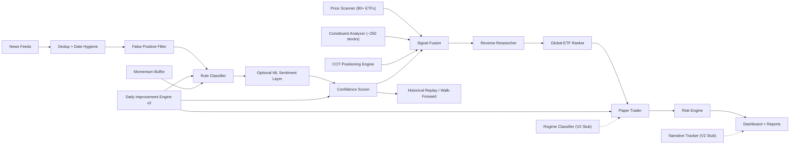

# Azalyst-ETF-Intelligence

Azalyst is an advanced quantitative research platform designed to capture global sector rotations through multi-engine signal fusion. By synthesizing high-entropy news data, real-time price action, institutional positioning (COT), and deep-holdings analysis, Azalyst provides an objective, cross-validated edge for global ETF strategy execution.

The platform operates a fully autonomous, serverless pipeline from discovery to risk-adjusted simulation, delivering actionable macro intelligence in an institutional research format.

Live Intelligence Dashboard: [https://gitdhirajsv.github.io/Azalyst-ETF-Intelligence/](https://gitdhirajsv.github.io/Azalyst-ETF-Intelligence/)

## The Azalyst Edge

- **Multi-Engine Signal Fusion**: Operates four independent analytical engines (News, Price, Constituents, COT) to achieve statistical consensus before capital deployment.
- **Dynamic Alpha Optimization**: An autonomous LLM-driven reinforcement loop that self-corrects analytical weights based on live performance data.
- **Institutional Execution Fidelity**: Models slippage, tiered fees (including India-specific STT/GST), bid-ask spreads, and liquidity constraints with Citadel-grade realism.
- **Price-Led discovery**: Prioritizes structural price breakouts as the primary discovery vector, using the news cycle as a secondary confirmation layer, never the reverse.
- **High-Fidelity Filtering**: Employs domain-authority weighting and temporal burst detection to isolate signal from syndicated noise and press-release floods.

## Supported Sectors

The classification engine actively monitors and routes signals for the following 11 intelligence categories:

- Energy / Oil & Gas
- Defense & Aerospace
- Gold & Precious Metals
- Technology & AI / Semiconductors
- Nuclear Energy & Uranium
- Cybersecurity
- India Equity Markets
- Crypto & Digital Assets
- Banking & Financial Sector
- Commodities & Mining
- Emerging Markets

## Current Architecture



## Autonomous Self-Improvement

The platform features continuous autonomous optimization. A daily scheduled pipeline executes the `self_improve_v2.py` engine, which replaces the v1 source-code-editing approach with a safer JSON-patch pattern:

1. Reads the latest performance data (portfolio P&L, alpha vs SPY, signal accuracy, open positions).
...
6. Commits the changed weights back to `main`, and the next 30-minute scan runs with the improved configuration.
7. A shadow-mode A/B baseline is captured. If the next cycle shows PnL regression, signal collapse, or volume explosion, the patch is automatically rolled back.

Every cycle is logged to `improvement_log.jsonl` for a full audit trail whether a change was applied or not.

### Safety Guardrails

The improvement engine can only modify these files:

- `scorer.py`: confidence scoring model
- `classifier.py`: sector keyword classifier
- `paper_trader.py`: trading logic
- `etf_mapper.py`: ETF database and ranking
- `news_fetcher.py`: RSS ingestion
- `reporter.py`: Discord formatting
- `classification_weights.json`: live weight registry (v2 patch target)
- `price_scanner.py`: ETF momentum and breakout scanner
- `constituent_analyzer.py`: top-holdings rotation detector
- `reverse_researcher.py`: unexplained-mover headline fetcher
- `signal_fusion.py`: cross-engine consensus merger
- `keyword_expansions.py`: supplementary keyword universe

Core orchestration files (`azalyst.py`, `config.py`, `risk_engine.py`) are read-only context, so the engine cannot touch them. Every proposed change must match the existing code verbatim before it is applied, and is syntax-checked in a temporary file before writing to disk.

### Setup

Add your NVIDIA NIM API key as a repository secret:

```
GitHub → Settings → Secrets and variables → Actions → New repository secret
Name:  NVIDIA_API_KEY
Value: your key from build.nvidia.com
```

The NVIDIA NIM endpoints for DeepSeek-V4-Pro and Qwen3 Coder 480B cover the daily volume.

## What Changed In This Version

- Global-first ETF selection:
  - ETF recommendations are now ranked across all mapped markets.
  - The engine employs rigorous objective selection rather than default list parsing.
- Better classifier behavior:
  - Word-boundary matching reduces substring false positives.
  - Directional signal scoring distinguishes bullish and bearish language.
  - Optional FinBERT-style sentiment support can run in `shadow` or `hybrid` mode.
  - Keyword universe expanded from ~430 to **1,030 keywords** across 17 sectors via `keyword_expansions.py` (macro themes, asset jargon, sector catalysts, trade policy, 200+ company tickers).
- Better news ingestion:
  - Fuzzy title dedup reduces paraphrased duplicate articles.
  - RSS timestamps now go through basic sanity checks.
  - 7 additional semiconductor RSS feeds added to `config.py`.
- Better false positive filtering:
  - Pre-scoring `FalsePositiveFilter` applies domain authority weighting (authority / mid-tier / denylist tiers).
  - Temporal burst detection blocks syndicated press-release echoes (>70% of articles within a 60-second window).
  - Headline entity entropy check blocks single-company press-release floods.
  - Domain denylist auto-grows nightly from paper-trade outcome history.
- **Institutional-Grade Scoring (Factor 6)**: Implements **Cross-Engine Signal Convergence**, a proprietary model that rewards signals achieving independent consensus across News, Price, and Constituent engines. This rebalancing ensures structural alpha is prioritized over noise-driven volatility.
- **Factor Orthogonalization**: Employs a rolling 60-observation correlation matrix to automatically down-weight correlated factors, preventing the double-counting of information (López de Prado methodology).
- Better execution realism:
  - Paper trading includes modeled fees and slippage.
  - Paper-trade execution is weekday-only: weekend runs can scan, mark prices, and report, but they do not open or close paper positions.
  - Position sizing employs a capped risk-budget approach for institutional-grade allocation.
  - **Realistic India cost model**: stamp duty (0.015% buy), STT (0.025% sell), GST on brokerage, SEBI charges, and NSE exchange fees now modeled explicitly.
  - **Pre-trade liquidity checks**: every entry validates ETF 20-day ADV and bid-ask spread. Positions capped at 1% of ADV; trades blocked if spread exceeds 50 bps (Citadel review recommendation).
  - India ETF minimum lot sizes enforced via lookup table (`INDIA_ETF_LOT_SIZES`).
- Better risk math:
  - Correlation modeling dynamically filters positive correlation while preserving negative diversification benefits.
  - Benchmark inception uses the actual start date window rather than a coarse range proxy.
  - **Multi-asset composite benchmark**: portfolio now tracked against a weighted composite (SPY 40% / GLD 30% / AGG 20% / INDA 10%) alongside SPY-only alpha. Active return reported against both.
  - **Trend-based graduated adjustment** replaces the binary Quant Blocker. ETFs below 200-day MA receive confidence and size multipliers rather than hard rejection. A Discord alert fires when adjustment exceeds 15%.
  - **External shock circuit breaker stub**: monitors TED spread proxy, VIX, gold/equity correlation, and EM FX vol. Flags `CIRCUIT_BREAKER_ACTIVE` when >= 3 stress indicators spike.
  - Stress testing maps assets more reliably, including gold-linked ETFs such as `GLDM`.
  - **Factor attribution**: Fama-French 5-factor + momentum regression available via `factor_attribution()` in `risk_engine.py`. Reports alpha intercept, factor loadings, R², and alpha t-stat.
- Better validation:
  - Historical replay backtester added.
  - Walk-forward window summaries supported for dated signal files.
  - **Walk-forward backtest validator** (`backtest_validator.py`): expanding-window cross-validation with deflated Sharpe ratio computation. Validates whether observed Sharpe survives multiple-testing correction before real capital deployment.
- Price-led detection:
  - `price_scanner.py`: daily scan of 80+ ETFs via yfinance (one bulk HTTP call). Emits signals on z-score >= 1.8, |5D| >= 3%, 20D breakout/breakdown, or RS divergence vs SPY.
  - `constituent_analyzer.py`: curated top-10 holdings (~250 unique stocks). Emits a sector rotation signal when >= 40% of holdings move directionally, typically 1 to 2 days before the ETF aggregate confirms.
  - `reverse_researcher.py`: triggered for unexplained price movers (price flagged, news silent). Pulls 8 recent headlines via Yahoo Finance's news graph and re-classifies at `min_articles=1`. Unmatched moves are tagged `news_orthogonal` and fed to the daily self-improver as missing-keyword evidence.
  - `signal_fusion.py`: merges all four engines (news, price, constituents, COT) per sector. **Fusion weights recalibrated:** PRICE 0.40, COT 0.25, NEWS 0.20, CONSTITUENTS 0.15. Price leads, news confirms, never the reverse. Tier C penalty removed for price-led and COT-led signals so early breakouts are not suppressed.
- **COT positioning engine** (`cot_fetcher.py`):
  - Downloads CFTC Commitments of Traders data (disaggregated) for gold, silver, crude oil, natural gas, copper, 10Y/30Y Treasuries, and S&P 500 E-mini.
  - Computes commercial hedger net positioning and 4-week velocity (rate of change).
  - Z-scores velocity against a 104-week (2-year) rolling window. Signals fire at |z| >= 1.5σ.
  - Maps each commodity to Azalyst sector IDs and ETF tickers (for example: gold to GLDM/GDX/GOLDBEES).
  - Degrades gracefully to synthetic neutral signals when CFTC data is unavailable.
- **Discord notification policy**:
  - Only actual paper-trade buy/sell events tag the decision-maker: entries, exits, stop-loss sells, and capital-rotation sells.
  - Routine scans, cycle digests, monitoring updates, trend adjustments, and end-of-day reports post without an @mention.
- Pre-signal momentum tracking:
  - `momentum_detector.py`: rolling 90-minute slope buffer per sector. WATCH state fires when d_score/30min >= 2.0; ALERT at >= 3.5. Pre-warms the price scanner and boosts `event_intensity` once the threshold crosses.
- **Design stubs for V2** (callable, not yet integrated):
  - `regime_classifier.py`: 2-state Hidden Markov Model stub (calm vs. stressed) using VIX thresholds. Will eventually drive dynamic fusion weight adjustments per regime.
  - `narrative_tracker.py`: headline clustering via keyword-overlap (sentence-transformers planned). Measures narrative coherence and story persistence over a rolling 5-day window.
- Autonomous improvement:
  - `self_improve.py` — identifies high-impact code improvements via LLM analysis.
  - `improvement_log.jsonl` — maintained audit log of all applied model changes.
  - Shadow-mode regression guard: auto-rollback if post-patch PnL drops >2pp.
  - Domain denylist growth: automatically expands from closed paper-trade outcomes.

## Key Files

- `azalyst.py`: live engine orchestration (multi-engine stack: news, price, constituents, COT)
- `config.py`: global configuration, sector definitions, and RSS feed registry
- `state.py`: persistence layer for portfolio, signals, and system health
- `self_improve.py`: daily autonomous model optimization via DeepSeek-V4-Pro (fallback: Qwen3)
- `news_fetcher.py`: ingestion, date parsing, dedup, and temporal burst filtering
- `classifier.py`: keyword-based rule engine and NLP classification logic
- `keyword_expansions.py`: 1,000+ supplementary keywords for macro theme detection
- `scorer.py`: 6-factor confidence scoring model with cross-engine confirmation
- `etf_mapper.py`: global ETF database, ranking, and objective selection logic
- `paper_trader.py`: realistic paper-trading engine with slippage and ROI modeling
- `risk_engine.py`: correlation, benchmark, volatility-sizing, and factor attribution
- `price_scanner.py`: daily ETF momentum, breakout, and relative-strength scanner
- `constituent_analyzer.py`: top-10 holdings rotation detector (~250 stocks)
- `reverse_researcher.py`: unexplained-mover headline investigator and re-classifier
- `signal_fusion.py`: consensus merger for news, price, constituents, and COT signals
- `cot_fetcher.py`: CFTC Commitments of Traders positioning engine
- `reporter.py`: Discord briefing dispatcher and research note generator
- `portfolio_reporter.py`: detailed performance, P&L, and risk attribution reports
- `quant_fetcher.py`: optimized bulk data fetching for technical scanning engines
- `regime_classifier.py`: V2 design, HMM-based market regime detection.
- `narrative_tracker.py`: V2 design, headline clustering and coherence tracker.
- `backtester.py`: historical signal replay and walk-forward evaluation engine
- `backtest_validator.py`: walk-forward cross-validation with deflated Sharpe ratio
- `generate_dashboard.py`: builds static status JSON and dashboard data
- `index.html`: live GitHub Pages dashboard interface
- `improvement_log.jsonl`: versioned audit log of all model optimizations

## Autonomous Deployment (No Local Setup Required)

Azalyst is entirely serverless and autonomous. You do not need to download the repository, run `.bat` files, or use local IDEs like Spyder to operate the engine.

### 1. Fork The Repository
Fork this repository to your own GitHub account.

### 2. Add Secrets
The engine requires two API keys to run its daily news fetch and self-improvement cycles.
Go to: **Settings → Secrets and variables → Actions → New repository secret**

| Secret | Purpose |
|---|---|
| `DISCORD_WEBHOOK_URL` | Live signal and portfolio trade alerts to Discord |
| `NVIDIA_API_KEY` | Daily self-improvement engine via NVIDIA NIM (DeepSeek-V4-Pro / Qwen) |

### 3. Enable GitHub Actions & Pages
1. Go to the **Actions** tab and click **"I understand my workflows, go ahead and enable them"**.
2. Go to **Settings → Pages**, set the source to **Deploy from a branch**, and select the `gh-pages` branch.

### 4. Let It Run
The engine is now fully autonomous:
- **Every 30 Minutes:** `run_azalyst.yml` fetches news, scans prices, fuses signals, executes paper trades, and deploys the live dashboard.
- **Every Night:** `daily_improve.yml` runs the Qwen self-improvement audit, applies a JSON weight patch, and auto-grows the domain denylist.

## Backtesting And Walk-Forward

Backtesting in this project means replaying dated historical signals against historical ETF prices with modeled execution costs.

Run a replay:

```bash
python backtester.py --signals data/backtest_events.sample.jsonl
```

Run replay plus walk-forward windows:

```bash
python backtester.py --signals data/backtest_events.sample.jsonl --walk-forward-splits 3
```

Expected input format:

```json
{
  "timestamp": "2025-01-15T10:30:00Z",
  "sectors": ["technology_ai"],
  "sector_label": "Technology & AI / Semiconductors",
  "confidence": 78,
  "severity": "HIGH"
}
```

The current sample file is intentionally small. It proves the replay engine works, but it is not enough to claim robust alpha. Real validation still requires a much larger dated signal archive.

## Dashboard And Public Track Record

The GitHub Pages dashboard reads from `status.json` and shows:

- portfolio NAV, cash, drawdown, reserve state
- open and closed trades
- active signal buckets
- ranked ETF opportunities
- market snapshot
- risk controls and Aladdin-style analytics

Note: The public simulation record serves as a transparent research log for ongoing model validation.

## Core Philosophies

- **Objective Transparency**: Deterministic scoring models are prioritized over black-box complexity.
- **Execution Realism**: Strategy validation is meaningless without modeling friction: slippage, gaps, fees, and liquidity.
- **Self-Healing Logic**: The system must autonomously identify and correct its own analytical biases.
- **Signal Priority**: Price leads the narrative, and the news cycle provides the corroborating evidence.

## System Scope and Limitations

- Designed for quantitative research simulation rather than live broker integration.
- Utilizes deterministic rule engines augmented by targeted ML layers.
- Focuses on signal generation and allocation heuristics rather than high-frequency execution.
- Ongoing empirical backtesting is required to establish robust, long-term alpha.
- Multi-engine modules degrade gracefully to no-ops if `yfinance` is unreachable — the system continues running news-only.

## Recommended Next Steps

- Build a larger dated signal dataset from historical news archives.
- Add benchmark-by-sector and regime-specific evaluation.
- Expand ETF metadata with live liquidity, spread, and expense-ratio feeds.
- Add a model registry for comparing rule-only vs hybrid ML variants.
- Add live monitoring around stop-gap risk and execution windows.
- Review `improvement_log.jsonl` weekly to audit what the engine changed and why.
- Expand `reports/missed_moves.json` signal archive to feed the reverse researcher more evidence for keyword auto-growth.

## Acknowledgments & "All-in-One" Architecture

Azalyst is designed as an all-in-one institutional macro engine, migrating and combining the best concepts from the world's top open-source quantitative repositories:
- **[koala73/worldmonitor](https://github.com/koala73/worldmonitor)**: Inspired the core news ingestion and classification heuristics.
- **[OpenBB-finance/OpenBB](https://github.com/OpenBB-finance/OpenBB)**: Inspired the integration of fundamental mathematical models and macro regime filters.
- **[freqtrade/freqtrade](https://github.com/freqtrade/freqtrade)**: Inspired the dynamic Step-ROI and time-based unclogging execution logic in our paper trader.
- **[AI4Finance-Foundation/FinRL](https://github.com/AI4Finance-Foundation/FinRL)**: Inspired the volatility-adjusted position sizing and transaction-cost penalty models.
- **[quantopian/zipline](https://github.com/quantopian/zipline)**: Inspired the event-driven historical backtesting architecture.
- **[ccxt/ccxt](https://github.com/ccxt/ccxt)**: Inspired the unified exchange and live execution routing concepts.
- **[polakowo/vectorbt](https://github.com/polakowo/vectorbt)**: Inspired the vectorized matrix-math risk correlation engine.
- **[Hudson-and-Thames/mlfinlab](https://github.com/Hudson-and-Thames/mlfinlab)**: Inspired the meta-labeling machine learning reinforcement loop.
- **[TA-Lib/ta-lib-python](https://github.com/TA-Lib/ta-lib-python)**: Inspired the quantitative and technical indicator generation layer.
- **[ranaroussi/yfinance](https://github.com/ranaroussi/yfinance)**: Powering our bulk price discovery and multi-engine ETF scanning.
- **[huggingface/transformers](https://github.com/huggingface/transformers)**: Powering our finance-tuned NLP sentiment and classification layers.
- **[NVIDIA/NIM](https://build.nvidia.com)**: Providing the infrastructure for our autonomous self-optimization cycles.
- **[deepseek-ai](https://github.com/deepseek-ai)**: The primary intelligence engine driving our daily structural improvements.

## License

MIT
