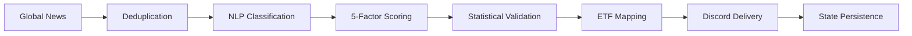

# Azalyst ETF Intelligence

> An institutional-style quantitative research platform built as a personal project. Not a hedge fund. Not a financial product. Just a passion for systematic research.

---

## Overview

Azalyst ETF Intelligence is a research infrastructure project for monitoring global news, classifying macro developments into investable sectors, and routing only the highest-conviction observations into a structured alert workflow. It is designed as a disciplined research system rather than a financial product, broker integration layer, or automated trading stack.

At a high level, the platform scans global news feeds, deduplicates and clusters related articles, applies a lightweight NLP-style sector classifier, computes a transparent five-factor confidence score, maps validated sector signals to ETFs across India and global markets, and delivers structured reports to Discord. Every cycle is logged locally, and signal state is persisted so the system can enforce cooldowns, detect stronger updates, and maintain an audit trail across runs.

The project exists for a simple reason: global macro events move faster than discretionary monitoring can reliably keep up with, yet most headline streams are too noisy to act on directly. Azalyst attempts to bridge that gap with disciplined filtering. The system is opinionated about what should qualify as a signal, conservative about what deserves distribution, and explicit about why a given alert cleared the bar.

Core capabilities:

- Global news scanning through **[WorldMonitor](https://github.com/koala73/worldmonitor)** and direct RSS feeds.
- Sector classification across 11 research buckets using weighted keyword rules, negation handling, and article clustering.
- Five-factor confidence scoring with transparent component breakdowns.
- ETF opportunity mapping for India and global markets.
- Structured Discord delivery via **[Discord Webhooks](https://discord.com/developers/docs/resources/webhook)**.
- Local state persistence and log-based auditability.

Research controls:

- Conservative delivery threshold: `62+` confidence.
- Minimum corroboration requirement: `2+` relevant articles.
- Cooldown mechanism: `4` hours per tracked signal basket.
- Update logic: stronger signals can re-issue before cooldown expiry if confidence improves materially.
- Audit trail logging through `azalyst.log` and persisted sector state in `azalyst_state.json`.

Primary dependencies:

- **[Python 3.9+](https://www.python.org/downloads/)**
- **[WorldMonitor](https://github.com/koala73/worldmonitor)**
- **[requests](https://pypi.org/project/requests/)**
- **[feedparser](https://pypi.org/project/feedparser/)**
- **[schedule](https://pypi.org/project/schedule/)**
- **[python-dateutil](https://pypi.org/project/python-dateutil/)**
- **[python-dotenv](https://pypi.org/project/python-dotenv/)**

## System Flow



`Statistical Validation` in this context refers to corroboration counts, source diversity checks, recency decay, severity weighting, threshold enforcement, and cooldown-aware update logic. The objective is to suppress noise rather than maximize alert volume.

## Installation

### 1. Clone the repository

```bash
git clone https://github.com/<your-username>/Azalyst-ETF-Intelligence.git
cd Azalyst-ETF-Intelligence
```

### 2. Install dependencies

```bash
pip install -r requirements.txt
```

### 3. Configure `.env`

Copy the example file and set your Discord webhook:

```bash
cp .env.example .env
```

```dotenv
WEBHOOK=https://discord.com/api/webhooks/your_webhook_here
INTERVAL=30
THRESHOLD=62
COOLDOWN_HOURS=4
MIN_ARTICLES=2
```

### 4. Run the system

```bash
python azalyst.py
```

Windows users can also launch:

```bat
START_AZALYST.bat
```

### Optional: Spyder launcher (Windows)

If you use Spyder for monitoring and interactive inspection, you can launch a dedicated Spyder instance alongside the engine:

```bat
Azalyst_Spyder.bat
```

This will:

- Prepare an isolated Spyder config directory (keeps this project independent of your global Spyder settings).
- Launch Spyder and auto-run `spyder_live_monitor.py` for a lightweight live status view.
- Start the Azalyst engine by calling `START_AZALYST.bat`.

If Spyder is not detected, launch Spyder manually and open `spyder_live_monitor.py`, then run the engine via `START_AZALYST.bat`.

## Configuration

The runtime accepts both concise `.env` keys and the existing `AZALYST_*` environment variable names for shell-based overrides.

| Parameter | Default | Type | Description |
|---|---:|---|---|
| `WEBHOOK` | Required | `string` | Discord webhook used for structured report delivery. Also supports `AZALYST_DISCORD_WEBHOOK`. |
| `INTERVAL` | `30` | `integer` | Scan interval in minutes. Also supports `AZALYST_INTERVAL`. |
| `THRESHOLD` | `62` | `integer` | Minimum confidence score required before a signal is delivered. Also supports `AZALYST_THRESHOLD`. |
| `COOLDOWN_HOURS` | `4` | `integer` | Minimum time between alerts on the same sector basket. Also supports `AZALYST_COOLDOWN_HOURS`. |
| `MIN_ARTICLES` | `2` | `integer` | Minimum corroborating articles required to form a signal cluster. Also supports `AZALYST_MIN_ARTICLES`. |

Additional advanced controls are available for update thresholds, paper-trading utilities, end-of-day reporting, fetch limits, and log level selection. See `.env.example` for the full local template.

## Confidence Score Model

The scoring model is intentionally transparent. Each signal is assigned a score from `0` to `100` as the sum of five deterministic components. No hidden weighting or opaque model calibration is used.

| Factor | Max Points | Description |
|---|---:|---|
| Signal Strength | `25` | Weighted keyword relevance accumulated across clustered articles. |
| Volume Confirmation | `20` | Number of corroborating articles supporting the same theme. |
| Source Diversity | `20` | Independent source confirmation, with tiered weighting for higher-credibility outlets. |
| Recency | `20` | Freshness of the most recent supporting article. |
| Geopolitical Severity | `15` | Event severity and regional macro impact. |

Only signals above the reporting threshold are delivered. By default, that means `62/100` or higher.

Example:

`Strait of Hormuz airstrike = 92/100 confidence`

| Factor | Score | Rationale |
|---|---:|---|
| Signal Strength | `23/25` | Strong keyword density around airstrike, oil supply, shipping lanes, and regional escalation. |
| Volume Confirmation | `16/20` | Seven corroborating articles across the same event cluster. |
| Source Diversity | `18/20` | Multiple independent sources, including top-tier international outlets. |
| Recency | `20/20` | Latest supporting article published within the last hour. |
| Geopolitical Severity | `15/15` | Critical event in a high-impact energy corridor. |
| **Total** | **`92/100`** | High-conviction signal suitable for immediate review. |

The practical value of the model is not that every alert is correct; it is that the scoring logic is inspectable, repeatable, and conservative enough to reduce discretionary overreaction to isolated headlines.

## Sector Coverage

India ETF tickers are selected for searchability on **[Dhan](https://dhan.co/)** and **[Kite](https://kite.zerodha.com/)**. Global tickers are intended for **[INDmoney](https://www.indmoney.com/)** and **[Vested](https://vestedfinance.com/)**, subject to regional availability and broker support.

| Sector | India (Dhan/Kite) | Global (INDmoney/Vested) |
|---|---|---|
| Energy & Oil | `CPSEETF`, `PSUBNKBEES` | `XLE`, `USO`, `IXC` |
| Defense & Aerospace | `DEFENCEETF`, `CPSEETF` | `ITA`, `XAR`, `PPA` |
| Precious Metals | `GOLDBEES`, `HDFCGOLD` | `GLDM`, `GDX`, `GDXJ` |
| Technology & AI | `MAFANG`, `NIFTYBEES` | `SOXX`, `QQQ`, `AIQ` |
| Nuclear & Uranium | `CPSEETF` | `URNM`, `URA`, `SRUUF` |
| Cybersecurity | `-` | `HACK`, `CIBR` |
| Broad India Equity | `NIFTYBEES`, `MIDCAPETF` | `INDA` |
| Banking & Finance | `BANKBEES` | `XLF`, `GLDM` |
| Commodities | `CPSEETF` | `DBC`, `COPP` |
| Emerging Markets | `NIFTYBEES` | `EEM`, `SPEM` |
| Cryptocurrencies | `-` | `IBIT`, `BITQ` |

The mapping layer is intentionally thesis-oriented rather than exhaustive. Each sector resolves to a small set of liquid instruments that can serve as a starting point for further research.

## File Structure

```text
.
|-- azalyst.py
|-- Azalyst_Spyder.bat
|-- config.py
|-- prepare_spyder_profile.py
|-- news_fetcher.py
|-- classifier.py
|-- scorer.py
|-- etf_mapper.py
|-- reporter.py
|-- state.py
|-- spyder_live_monitor.py
|-- requirements.txt
|-- START_AZALYST.bat
|-- docs/
|-- paper_trader.py
|-- portfolio_reporter.py
`-- generate_dashboard.py
```

Runtime artifacts such as `azalyst.log`, `azalyst_state.json`, and `azalyst_portfolio.json` are generated locally and should not be treated as source files.

The `docs/` directory is reserved for deeper research notes, methodology writeups, and future architecture documentation that should remain outside the top-level operational path.

## Usage Examples

Basic run:

```bash
python azalyst.py
```

Custom threshold:

```bash
AZALYST_THRESHOLD=70 python azalyst.py
```

Extended cooldown:

```bash
AZALYST_COOLDOWN_HOURS=8 python azalyst.py
```

If you are using PowerShell, set environment variables with `$env:AZALYST_THRESHOLD=70` before running the command.

## Troubleshooting

- No alerts firing: confirm that `WEBHOOK` is set correctly, inspect `azalyst.log`, and temporarily lower the threshold to verify end-to-end delivery.
- Too many alerts: raise `THRESHOLD`, increase `COOLDOWN_HOURS`, and review whether `MIN_ARTICLES` is too permissive for your use case.
- News not loading: verify internet connectivity, test without VPN or restrictive proxy settings, and inspect feed errors in `azalyst.log`.

## Architecture Notes for Researchers

### Design principles

The system is built around transparent research mechanics. Classification is rule-based and inspectable. Scoring is additive and deterministic. Thresholds are explicit. State persistence is local and human-readable. The intent is to make every alert explainable after the fact, which is often more useful in a personal research setting than marginal gains from opaque model complexity.

The platform is also deliberately signal-first rather than price-first. It does not try to predict intraday market microstructure, route orders, optimize execution, or construct a portfolio frontier. Its role is upstream in the research stack: identifying macro developments early, framing them consistently, and presenting a disciplined starting point for human review.

Each delivered alert is meant to be interpretable on its own. The report structure exposes the detected sector basket, source set, recent headlines, score breakdown, and ETF mapping in a format that can be reviewed quickly without leaving the messaging layer. That makes the system useful both for active monitoring and for later post-event review when refining thresholds or mappings.

### Validation approach

Validation is based on corroboration and restraint. A signal is not formed from a single headline; it requires at least two relevant articles. Independent source coverage increases the score. Freshness matters, so older clusters decay naturally. Higher-severity regions and events receive more weight, but not enough to bypass corroboration. Cooldown enforcement prevents the same theme from being repeatedly surfaced unless confidence improves enough to justify an update.

This is not statistical validation in the sense of a formal event study or hypothesis test. It is a structured confidence framework designed to create a repeatable filter between raw headlines and research attention.

In practice, this means the system behaves more like an internal triage layer than an oracle. Researchers should treat the score as a ranking signal for attention allocation, then pair it with independent market context, instrument liquidity checks, and thesis-specific risk work before making any portfolio decision.

### Known limitations

- Feed quality and timing are constrained by the upstream sources being monitored.
- The classifier is robust for obvious macro themes, but subtle context and sarcasm remain hard problems for rule-based systems.
- ETF mapping is a research convenience layer, not a guarantee of availability, liquidity, or suitability.
- The system does not backtest signal efficacy, estimate expected return distributions, or model transaction costs.
- Discord delivery is operationally useful, but it is not a substitute for a research database or event warehouse.

## Attribution and Acknowledgments

**[WorldMonitor](https://github.com/koala73/worldmonitor)** by [@koala73](https://github.com/koala73) provides the foundation for global news aggregation. The system would not function without WorldMonitor's robust and comprehensive news pipeline.

Azalyst also depends on the open-source Python ecosystem for feed parsing, scheduling, HTTP transport, date handling, and local configuration management.

## Contributing

Contributions are welcome, especially in the following areas:

- New sector mappings and ETF coverage improvements.
- Broker and platform integration refinements.
- Signal analysis, validation methodology, and research instrumentation.
- Documentation, reproducibility improvements, and architecture notes.

Small, well-scoped pull requests with clear reasoning are preferred. If you change scoring logic or sector mappings, include a short note describing the research rationale.

## License

Released under the **MIT License**. See `LICENSE`.

## Disclaimer

This is a personal research and learning project. Azalyst is not a financial service, investment advisor, or trading algorithm. Nothing here is financial advice.

Use entirely at your own risk. Past signal performance does not guarantee future results. All investments carry risk of loss. Consult a qualified financial advisor before making investment decisions.

Verify all ETF availability on your broker platform before trading. Regulatory status and product offerings vary by region and institution.

Built by **Azalyst** | Azalyst Quant Research
