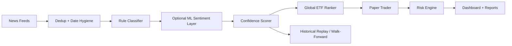

# Azalyst ETF Intelligence

Azalyst is a global ETF intelligence and paper-trading research platform. It monitors macro and market news, converts relevant events into sector signals, ranks ETF implementations across global markets, simulates position management, and publishes a live dashboard to GitHub Pages.

This repo is a research system, not a live broker-integrated trading product and not investment advice.

Live dashboard: [https://gitdhirajsv.github.io/Azalyst-ETF-Intelligence/](https://gitdhirajsv.github.io/Azalyst-ETF-Intelligence/)

## What It Does

- Scans global news feeds and direct RSS sources.
- Classifies articles into ETF-relevant sectors such as energy, defense, gold, AI, banking, crypto, India, emerging markets, and more.
- Uses a transparent confidence model with signal strength, corroboration, source quality, recency, and event intensity.
- Ranks ETF candidates globally instead of defaulting to "India vs global" buckets.
- Simulates paper trades with explicit fees, slippage, stops, partial profit-taking, sector caps, and reserve cash.
- Generates a static dashboard from local state for GitHub Pages.
- Replays dated historical signals through a backtester to compare results with benchmarks.

## Current Architecture



## What Changed In This Version

- Global-first ETF selection:
  - ETF recommendations are now ranked across all mapped markets.
  - The live engine no longer picks the first ETF in a list by default.
- Better classifier behavior:
  - Word-boundary matching reduces substring false positives.
  - Directional signal scoring distinguishes bullish and bearish language.
  - Optional FinBERT-style sentiment support can run in `shadow` or `hybrid` mode.
- Better news ingestion:
  - Fuzzy title dedup reduces paraphrased duplicate articles.
  - RSS timestamps now go through basic sanity checks.
- Better scoring model:
  - Volume, source diversity, recency, and signal strength now use smooth functions instead of hard cliffs.
  - Event intensity is less circular than the old severity logic.
- Better execution realism:
  - Paper trading includes modeled fees and slippage.
  - Position sizing uses a capped risk-budget approach instead of arbitrary Kelly assumptions.
- Better risk math:
  - Correlation blocking now focuses on positive correlation instead of rejecting strong negative diversification.
  - Benchmark inception uses the actual start date window rather than a coarse range proxy.
  - Stress testing maps assets more reliably, including gold-linked ETFs such as `GLDM`.
- Better validation:
  - Historical replay backtester added.
  - Walk-forward window summaries supported for dated signal files.

## Key Files

- `azalyst.py`: live engine orchestration
- `news_fetcher.py`: ingestion, date parsing, dedup
- `classifier.py`: rule engine plus optional ML sentiment layer
- `scorer.py`: confidence scoring
- `etf_mapper.py`: global ETF ranking and market alternatives
- `paper_trader.py`: realistic paper-trading engine
- `risk_engine.py`: correlation, benchmark, vol, rebalance, stress test
- `backtester.py`: historical replay and walk-forward evaluation
- `generate_dashboard.py`: builds `status.json`
- `index.html`: GitHub Pages dashboard

## Setup

### 1. Clone

```bash
git clone https://github.com/gitdhirajsv/Azalyst-ETF-Intelligence.git
cd Azalyst-ETF-Intelligence
```

### 2. Install Dependencies

```bash
pip install -r requirements.txt
```

### 3. Configure Environment

Create `.env` from `.env.example` and set at least your Discord webhook if you want alerts.

Example settings:

```dotenv
WEBHOOK=https://discord.com/api/webhooks/your_webhook_here
INTERVAL=30
THRESHOLD=62
COOLDOWN_HOURS=4
MIN_ARTICLES=2
MAX_ARTICLES=300
MAX_ARTICLE_AGE_DAYS=7
PAPER_TRADING=true

# Optional ML sentiment layer
ML_SENTIMENT_ENABLED=true
ML_SENTIMENT_MODE=shadow
ML_SENTIMENT_MODEL=ProsusAI/finbert
ML_SENTIMENT_MIN_CONFIDENCE=0.58

# Optional fuzzy title dedup tuning
FUZZY_TITLE_DEDUP_THRESHOLD=0.92
```

Notes:

- `ML_SENTIMENT_MODE=shadow` logs and surfaces ML sentiment without letting it change direction bias.
- `ML_SENTIMENT_MODE=hybrid` lets the ML layer influence direction on selected sectors where positive and negative sentiment maps cleanly to ETF direction.
- The default FinBERT path expects a recent `torch` build. Keep `torch>=2.6.0` to avoid model-loading security restrictions in newer `transformers`.

### 4. Run The Engine

```bash
python azalyst.py
```

### 5. Regenerate The Dashboard

```bash
python generate_dashboard.py
```

This writes `status.json`, which powers the GitHub Pages site.

## Backtesting And Walk-Forward

Backtesting in this project means replaying dated historical signals against historical ETF prices with modeled execution costs.

Run a replay:

```bash
python backtester.py --signals data/backtest_events.sample.jsonl
```

Run replay plus walk-forward windows:

```bash
python backtester.py --signals data/backtest_events.sample.jsonl --walk-forward-splits 3
```

Expected input format:

```json
{
  "timestamp": "2025-01-15T10:30:00Z",
  "sectors": ["technology_ai"],
  "sector_label": "Technology & AI / Semiconductors",
  "confidence": 78,
  "severity": "HIGH"
}
```

The current sample file is intentionally small. It proves the replay engine works, but it is not enough to claim robust alpha. Real validation still requires a much larger dated signal archive.

## Dashboard And Public Track Record

The GitHub Pages dashboard reads from `status.json` and shows:

- portfolio NAV, cash, drawdown, reserve state
- open and closed trades
- active signal buckets
- ranked ETF opportunities
- market snapshot
- risk controls and Aladdin-style analytics

Important: the public live paper record is still short. Treat it as a transparent research log, not proof of durable edge.

## Design Principles

- Global first, not country siloed.
- Transparent scoring before black-box complexity.
- ML added carefully, with fallback behavior.
- Execution realism matters: costs, slippage, gaps, diversification, and volatility.
- Validation matters as much as signal generation.

## What This Is Not Yet

- Not a broker-connected live trading system.
- Not a fully trained custom transformer stack.
- Not a production institutional optimizer.
- Not statistically validated enough yet to claim outperformance over major asset managers or passive benchmarks.

## Recommended Next Steps

- Build a larger dated signal dataset from historical news archives.
- Add benchmark-by-sector and regime-specific evaluation.
- Expand ETF metadata with live liquidity, spread, and expense-ratio feeds.
- Add a model registry for comparing rule-only vs hybrid ML variants.
- Add live monitoring around stop-gap risk and execution windows.

## License

MIT
